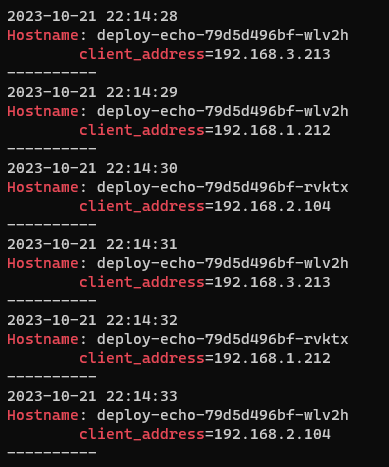
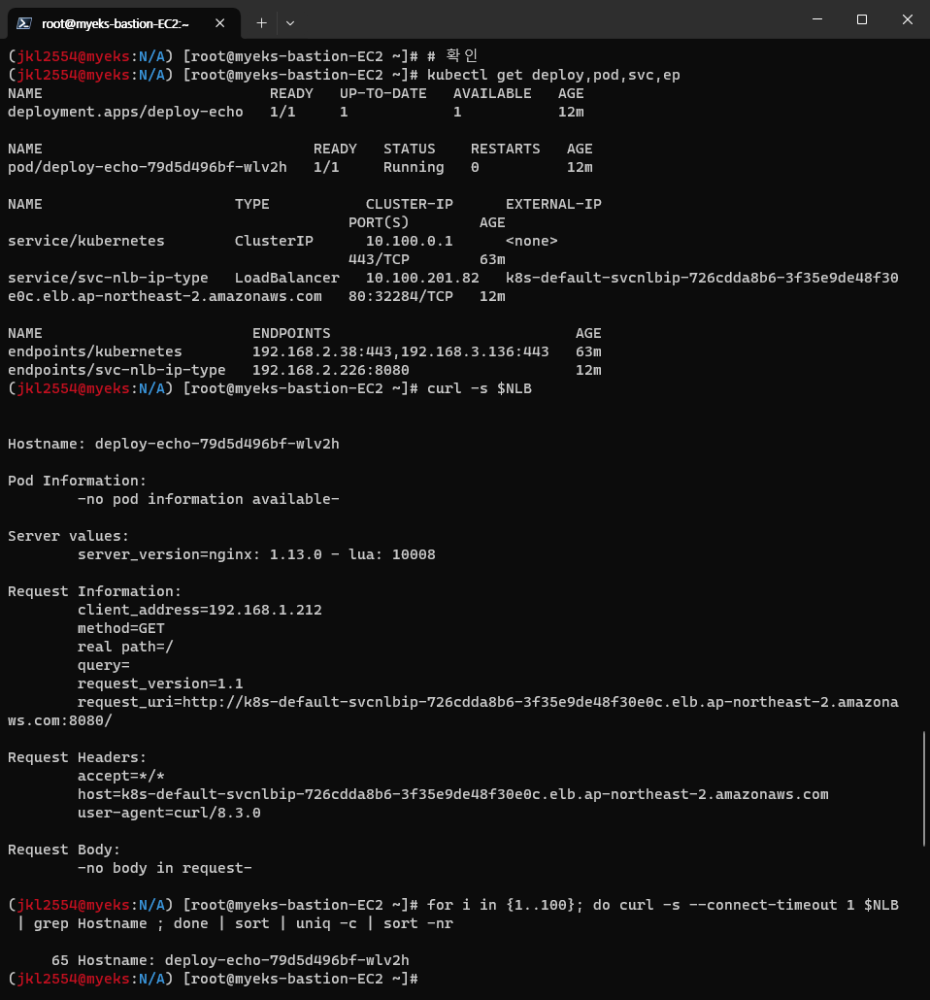
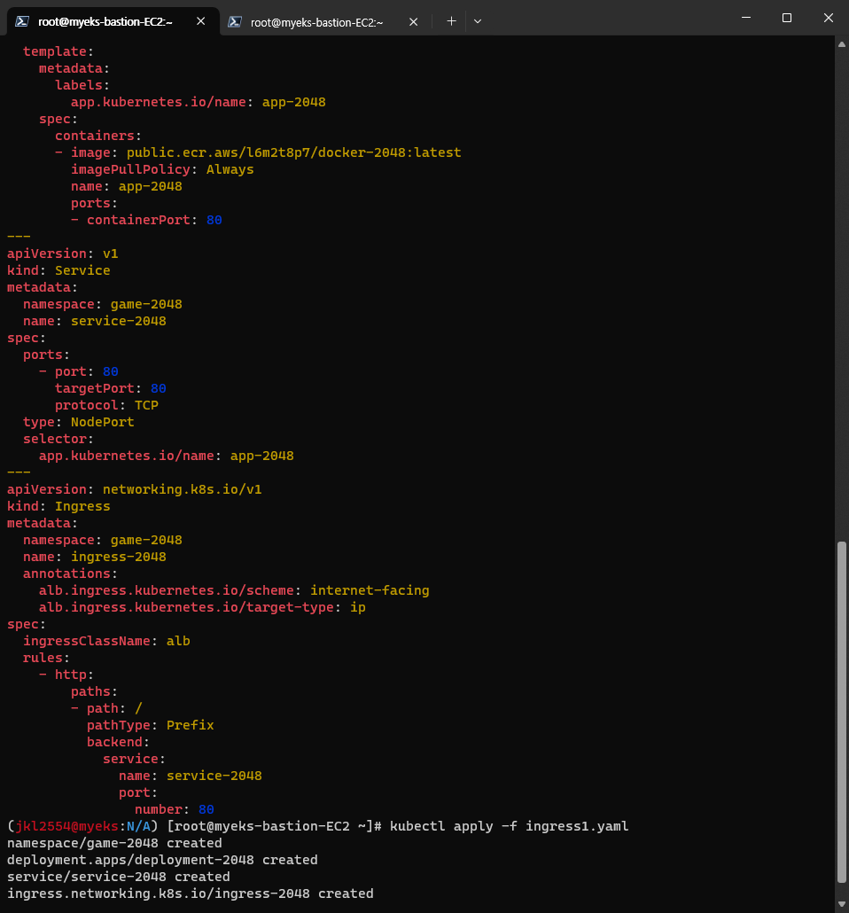
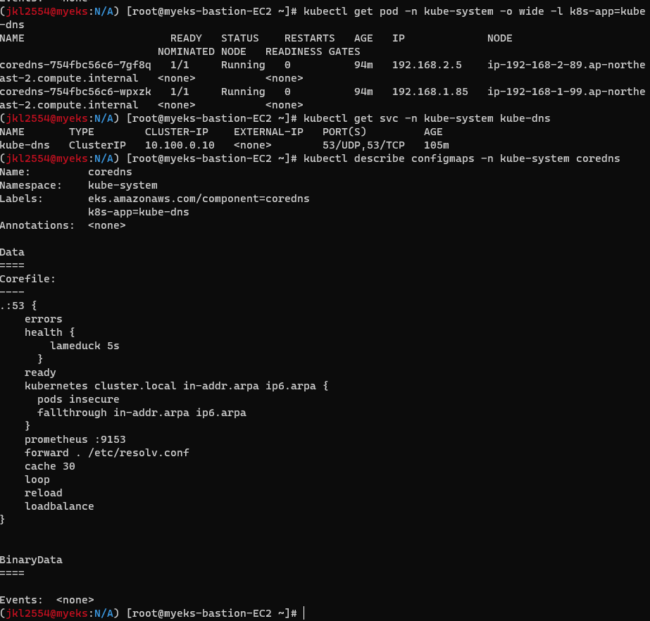
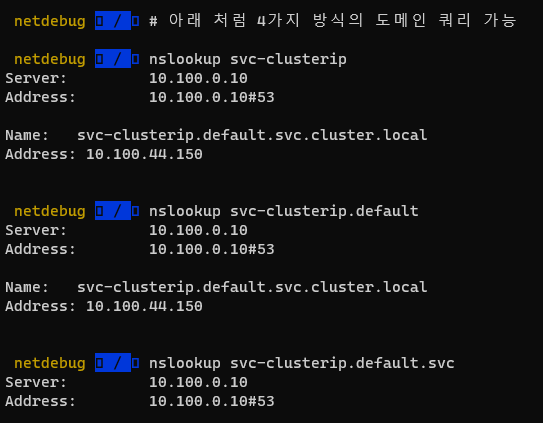
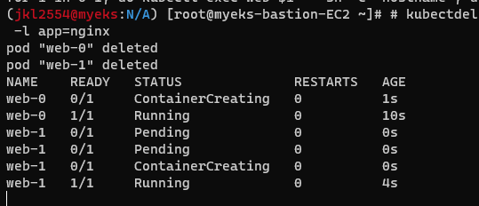

# 학습내용 정리
## Kubernetes란?
- 컨테이너화된 애플리케이션을 관리해주는 오케스트레이터
- Pod라는 리소스에 Container를 담아 오케스트레이션을 수행
- 클러스터를 관리하는 Control Plane과 컨테이너 애플리케이션이 배포되는 Node가 있다.


## Amazone EKS
- AWS에서 제공하는 Kubernetes Service 
- 여러 AWS 서비스와 통합을 통해 부하분산, 인증, 네트워크 격리 등 제공
- AWS 서비스에서 제공되는 플러그인외에 Kubenretes에서 제공하는 다양한 플러그인 사용 가능
- Control Plane이 AWS에서 Managed되기 때문에 Master Node와 같은 추가 리소스가 필요하지 않음

## 쿠버네티스의 스토리지
- 쿠버네티스는 Pod가 중지되면 내부의 스토리지 데이터는 모두 삭제됨
- 데이터베이스와 같이 데이터 보존이 필요한 스토리지는 PV에 배포해 데이터를 보존할 수 있다.
- Pod에 PV를 마운트하기 위해서 PVC를 통해 마운트를 수행할 수 있다.

## Service
- 쿠버네티스에서 애플리케이션을 외부에 노출하기위해 사용되는 리소스
- Selector를 설정해 Pod 해당 조건의 Pod에 연결되는데, Endpoints리소스에 해당 사항이 선언된다.
- 종류는 ClusterIP, NodePort, Loadbalaner가 있으며, Loadbalaner타입의 경우에 별도 모듈(MetalLB)이 필요하다.
- EKS는 AWS Load Balancer Controller + NLB IP 모드 동작 with AWS VPC CNI 구성으로 Pod의 CNI에 바로 직접 연결이 가능하다.

## Ingress
- 쿠버네티스에서 L7로드밸런싱을 위한 리소스
- 배포 및 사용을 위해서는 별도 컨트롤러(Nginx Ingress Controller) 설치가 필요하다.
- EKS에서는 ALB Ingress Controller를 통해 사용할 수 있다.

## ExternalDNS
- 쿠버네티스에서 Ingress리소스를 배포함에 따라 도메인등록을 자동으로 해 주는 리소스
- 배포 및 사용을 위해서는 별도 컨트롤러 배포가 필요하며, AWS, Azure, GCP에서는 배포와 동시에 해당 리소스에 등록할 수 있도록 개발이 돼 있다.

## CoreDNS
- 쿠버네티스 내부 리소스간 DNS쿼리를 위한 리소스
- 기본적으로 Pod에서 Service를 DNS쿼리할 때(ClusterIP로 응답)응답을 주는 리소스

## Deployment
- 쿠버네티스에서 Pod를 관리하는 기본적인 리소스
- 컨트롤러에서 선언된 Deployment를 따라 ReplicaSet을 생성하여 Pod를 관리한다.

## StatefulSet
- 각 Pod를 Stateful하게 배포하는 리소스
- 스케쥴링이 변경되더라도 배포 순서, 볼륨, Pod이름 등 지속성을 유지하며 Pod를 배포할 수 있다.
- Headless Service를 활용하면 Subdomain에 각 Pod의 이름을 사용하면 Pod를 지정해 접근할 수 있다.

# 실습
## Amazone EKS 배포
eks-oneclick.yaml 내용:`curl -O https://s3.ap-northeast-2.amazonaws.com/cloudformation.cloudneta.net/EKS/eks-oneclick.yaml`
- 생성 전 ssh key를 먼저 생성 해둬야함(EC2 - 키페어)

### 생성된 리소스
  
[VPC 및 서브넷]  
  
[배포 EC2인스턴스]  
  
  
[공인 IP주소획득 후 Bastion에 접속]  

## NLB Service 배포 실습
### 애플리케이션 배포

  
[Deployment 생성]  
### 서비스 테스트

  
[웹 접속 확인]  

  
[분산접속 확인]  
  
[지속 접속 시도]  

### 파드 개수 설정 테스트

  
[파드 1개]  
  
[파드 3개]  
  
[리소스 정리]  

## ALB Ingress 배포 실습
### 애플리케이션 배포
  
[애플리케이션 배포]  
  
[쿠버네티스 리소스 모니터링]  

  
[배포 확인]  


  
[게임 접속]  

  
[파드 증가 명령]  


  
[스케일링 확인]  

  
[파드 감소 명령]  

  
[스케일링 확인] 
### 리소스 제거

## ExternalDNS
### 모니터링용 터미널
### 애플리케이션 배포
  
[테트리스 배포]  

  
[NLB 배포 중]  

  
[테트리스 배포 완료]  

### ExternalDNS 사용

  
[명령 실행 결과]  

  
[도메인 연결 결과]  

## CoreDNS

### CoreDNS 존재 확인

  
[coreDNS 확인]  
### 테스트를 위해 coreDNS Pod 수량 1개로 조절

  

  
[coreDNS 파드 네임서버 도메인 테스트]  
- 

  
[resolv.conf]  
이 클러스터의 파드는 
```
default.svc.cluster.local
svc.cluster.local
cluster.local
ap-northeast-2.compute.internal
``` 
의 기본 도메인을 가지고 있음을 알 수 있다.  
도메인 쿼리 결과와 같은 결과가 나온다  

  
[도메인 쿼리 결과]  

## 스테이트풀 셋 & 헤드리스 서비스


  
[헤드리스 배포 테스트]  

  
[삭제된 파드 재실행 순서]  
  
[NS Lookup 확인]  

[볼륨 마운트 정보 확인]  
