# 학습내용 정리
## Kubernetes란?
- 컨테이너화된 애플리케이션을 관리해주는 오케스트레이터
- Pod라는 리소스에 Container를 담아 오케스트레이션을 수행
- 클러스터를 관리하는 Control Plane과 컨테이너 애플리케이션이 배포되는 Node가 있다.


## Amazone EKS
- AWS에서 제공하는 Kubernetes Service 
- 여러 AWS 서비스와 통합을 통해 부하분산, 인증, 네트워크 격리 등 제공
- AWS 서비스에서 제공되는 플러그인외에 Kubenretes에서 제공하는 다양한 플러그인 사용 가능
- Control Plane이 AWS에서 Managed되기 때문에 Master Node와 같은 추가 리소스가 필요하지 않음

## 쿠버네티스의 스토리지
- 쿠버네티스는 Pod가 중지되면 내부의 스토리지 데이터는 모두 삭제됨
- 데이터베이스와 같이 데이터 보존이 필요한 스토리지는 PV에 배포해 데이터를 보존할 수 있다.
- Pod에 PV를 마운트하기 위해서 PVC를 통해 마운트를 수행할 수 있다.

## Service
- 쿠버네티스에서 애플리케이션을 외부에 노출하기위해 사용되는 리소스
- Selector를 설정해 Pod 해당 조건의 Pod에 연결되는데, Endpoints리소스에 해당 사항이 선언된다.
- 종류는 ClusterIP, NodePort, Loadbalaner가 있으며, Loadbalaner타입의 경우에 별도 모듈(MetalLB)이 필요하다.
- EKS는 AWS Load Balancer Controller + NLB IP 모드 동작 with AWS VPC CNI 구성으로 Pod의 CNI에 바로 직접 연결이 가능하다.

## Ingress
- 쿠버네티스에서 L7로드밸런싱을 위한 리소스
- 배포 및 사용을 위해서는 별도 컨트롤러(Nginx Ingress Controller) 설치가 필요하다.
- EKS에서는 ALB Ingress Controller를 통해 사용할 수 있다.

## ExternalDNS
- 쿠버네티스에서 Ingress리소스를 배포함에 따라 도메인등록을 자동으로 해 주는 리소스
- 배포 및 사용을 위해서는 별도 컨트롤러 배포가 필요하며, AWS, Azure, GCP에서는 배포와 동시에 해당 리소스에 등록할 수 있도록 개발이 돼 있다.

## CoreDNS
- 쿠버네티스 내부 리소스간 DNS쿼리를 위한 리소스
- 기본적으로 Pod에서 Service를 DNS쿼리할 때(ClusterIP로 응답)응답을 주는 리소스

## Deployment
- 쿠버네티스에서 Pod를 관리하는 기본적인 리소스
- 컨트롤러에서 선언된 Deployment를 따라 ReplicaSet을 생성하여 Pod를 관리한다.

## StatefulSet
- 각 Pod를 Stateful하게 배포하는 리소스
- 스케쥴링이 변경되더라도 배포 순서, 볼륨, Pod이름 등 지속성을 유지하며 Pod를 배포할 수 있다.
- Headless Service를 활용하면 Subdomain에 각 Pod의 이름을 사용하면 Pod를 지정해 접근할 수 있다.

# 실습
## Amazone EKS 배포
eks-oneclick.yaml 내용:`curl -O https://s3.ap-northeast-2.amazonaws.com/cloudformation.cloudneta.net/EKS/eks-oneclick.yaml`
- 생성 전 ssh key를 먼저 생성 해둬야함(EC2 - 키페어)

### 생성된 리소스
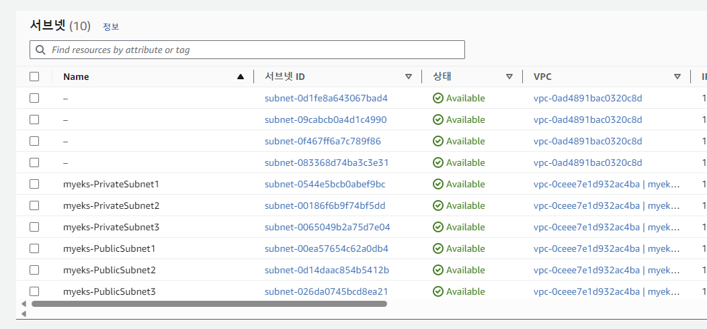  
[VPC 및 서브넷]  
  
[배포 EC2인스턴스]  
  
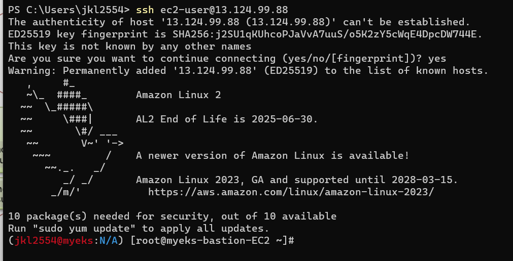  
[공인 IP주소획득 후 Bastion에 접속]  

#### 기본 설정 작업 수행

```
###################################

# AWS Load Balancer Controller

## 설치
helm repo add eks https://aws.github.io/eks-charts
helm repo update
helm install aws-load-balancer-controller eks/aws-load-balancer-controller -n kube-system --set clusterName=$CLUSTER_NAME   --set serviceAccount.create=false --set serviceAccount.name=aws-load-balancer-controller

## 설치 확인
kubectl get crd
kubectl get deployment -n kube-system aws-load-balancer-controller
kubectl describe deploy -n kube-system aws-load-balancer-controller


###################################

# ExternalDNS
MyDomain=<자신의 도메인>
echo "export MyDomain=<자신의 도메인>" >> /etc/profile
MyDomain=hyugo.click
echo "export MyDomain=hyugo.click" >> /etc/profile
MyDnsHostedZoneId=$(aws route53 list-hosted-zones-by-name --dns-name "${MyDomain}." --query "HostedZones[0].Id" --output text)
echo $MyDomain, $MyDnsHostedZoneId

## ExternalDNS 컨트롤러 설치
curl -s -O https://raw.githubusercontent.com/cloudneta/cnaeblab/master/_data/externaldns.yaml
MyDomain=$MyDomain MyDnsHostedZoneId=$MyDnsHostedZoneId envsubst < externaldns.yaml | kubectl apply -f -


###################################

# kube-ops-view

## kube-ops-view 설치
helm repo add geek-cookbook https://geek-cookbook.github.io/charts/
helm install kube-ops-view geek-cookbook/kube-ops-view --version 1.2.2 --set env.TZ="Asia/Seoul" --namespace kube-system
kubectl patch svc -n kube-system kube-ops-view -p '{"spec":{"type":"LoadBalancer"}}'
kubectl annotate service kube-ops-view -n kube-system "external-dns.alpha.kubernetes.io/hostname=kubeopsview.$MyDomain"
echo -e "Kube Ops View URL = http://kubeopsview.$MyDomain:8080/#scale=1.5"

## 확인 및 로그 모니터링
kubectl get pod -l app.kubernetes.io/name=external-dns -n kube-system
kubectl logs deploy/external-dns -n kube-system -f


###################################

# 스토리지 클래스 생성

## gp2 기본 스토리지 클래스 default 설정 제거
kubectl patch sc gp2 -p '{"metadata": {"annotations":{"storageclass.kubernetes.io/is-default-class":"false"}}}'

## gp3 스토리지 클래스 생성
kubectl apply -f https://raw.githubusercontent.com/gasida/DOIK/main/1/gp3-sc.yaml

## 스토리지 클래스 확인
kubectl get sc


###################################

# AWS Cert Manager 인증서 설정

## ACM 인증서 확인
aws acm list-certificates

## ACM 인증서 변수 선언
CERT_ARN=`aws acm list-certificates --query 'CertificateSummaryList[].CertificateArn[]' --output text`; echo $CERT_ARN
```

## NLB Service 배포 실습
### 애플리케이션 배포
```
# 작업용 EC2 - 디플로이먼트 & 서비스 생성
curl -s -O https://raw.githubusercontent.com/gasida/PKOS/main/2/echo-service-nlb.yaml
cat echo-service-nlb.yaml | yh
kubectl apply -f echo-service-nlb.yaml

# 확인
kubectl get deploy,pod
kubectl get svc,ep,ingressclassparams,targetgroupbindings
kubectl get targetgroupbindings -o json | jq
```
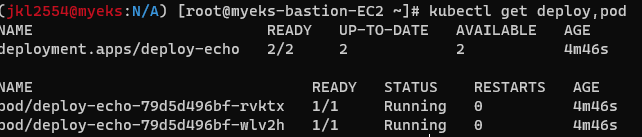  
[Deployment 생성]  
### 서비스 테스트
```
# AWS ELB(NLB) 정보 확인
aws elbv2 describe-load-balancers | jq
aws elbv2 describe-load-balancers --query 'LoadBalancers[*].State.Code' --output text

# 웹 접속 주소 확인
kubectl get svc svc-nlb-ip-type -o jsonpath={.status.loadBalancer.ingress[0].hostname} | awk '{ print "Pod Web URL = http://"$1 }'

# 파드 로깅 모니터링
kubectl logs -l app=deploy-websrv -f
```
  
[웹 접속 확인]  
```
# 분산 접속 확인
NLB=$(kubectl get svc svc-nlb-ip-type -o jsonpath={.status.loadBalancer.ingress[0].hostname})
curl -s $NLB
for i in {1..100}; do curl -s $NLB | grep Hostname ; done | sort | uniq -c | sort -nr

# 지속적인 접속 시도 : 아래 상세 동작 확인 시 유용(패킷 덤프 등)
while true; do curl -s --connect-timeout 1 $NLB | egrep 'Hostname|client_address'; echo "----------" ; date "+%Y-%m-%d %H:%M:%S" ; sleep 1; done
```
  
[분산접속 확인]  
  
[지속 접속 시도]  

### 파드 개수 설정 테스트
```
# 작업용 EC2 - 파드 1개 설정 
kubectl scale deployment deploy-echo --replicas=1

# 확인
kubectl get deploy,pod,svc,ep
curl -s $NLB
for i in {1..100}; do curl -s --connect-timeout 1 $NLB | grep Hostname ; done | sort | uniq -c | sort -nr
```

  
[파드 1개]  
```
# 작업용 EC2 - 파드 3개 설정 
kubectl scale deployment deploy-echo --replicas=3

# 확인
kubectl get deploy,pod,svc,ep
curl -s $NLB
for i in {1..100}; do curl -s --connect-timeout 1 $NLB | grep Hostname ; done | sort | uniq -c | sort -nr
```
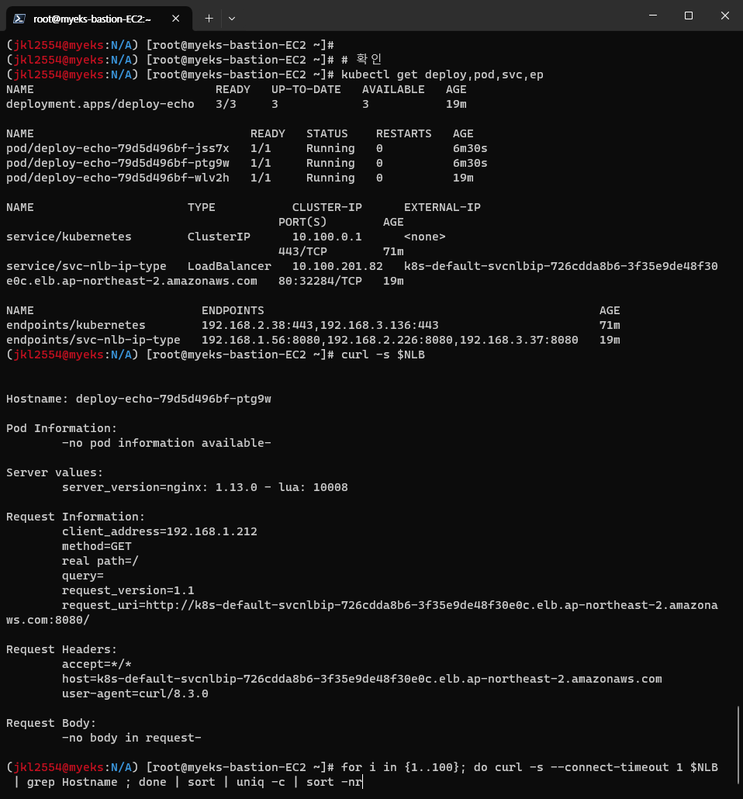  
[파드 3개]  
```
## 리소스 제거
kubectl delete deploy deploy-echo; kubectl delete svc svc-nlb-ip-type
```
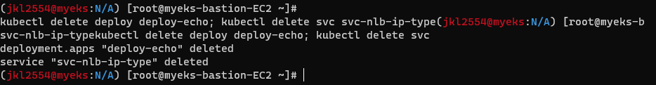  
[리소스 정리]  

## ALB Ingress 배포 실습
### 애플리케이션 배포
```
# 게임 파드와 Service, Ingress 배포
curl -s -O https://raw.githubusercontent.com/gasida/PKOS/main/3/ingress1.yaml
cat ingress1.yaml | yh
kubectl apply -f ingress1.yaml
# 모니터링
watch -d kubectl get pod,ingress,svc,ep -n game-2048
```
  
[애플리케이션 배포]  
  
[쿠버네티스 리소스 모니터링]  

```
# 생성 확인
kubectl get-all -n game-2048
kubectl get ingress,svc,ep,pod -n game-2048
kubectl get targetgroupbindings -n game-2048
NAME                               SERVICE-NAME   SERVICE-PORT   TARGET-TYPE   AGE
k8s-game2048-service2-e48050abac   service-2048   80             ip            87s

# Ingress 확인
kubectl describe ingress -n game-2048 ingress-2048

# 게임 접속 : ALB 주소로 웹 접속
kubectl get ingress -n game-2048 ingress-2048 -o jsonpath={.status.loadBalancer.ingress[0].hostname} | awk '{ print "Game URL = http://"$1 }'

# 파드 IP 확인
kubectl get pod -n game-2048 -owide
```
  
[배포 확인]  


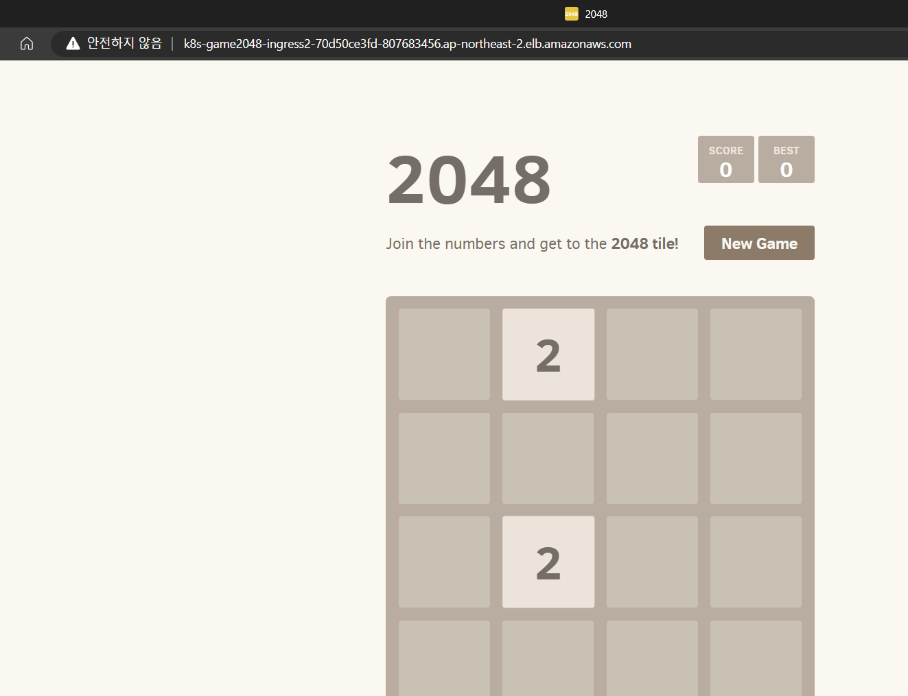  
[게임 접속]  

```
# 터미널1
watch kubectl get pod -n game-2048

# 터미널2 : 파드 3개로 증가
kubectl scale deployment -n game-2048 deployment-2048 --replicas 3

# 터미널2 : 파드 1개로 감소
kubectl scale deployment -n game-2048 deployment-2048 --replicas 1
```
  
[파드 증가 명령]  


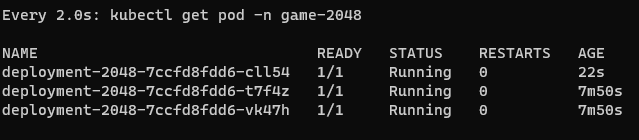  
[스케일링 확인]  

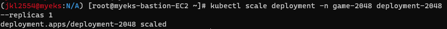  
[파드 감소 명령]  

  
[스케일링 확인] 
### 리소스 제거
```
kubectl delete ingress ingress-2048 -n game-2048
kubectl delete svc service-2048 -n game-2048 && kubectl delete deploy deployment-2048 -n game-2048 && kubectl delete ns game-2048
```

## ExternalDNS
### 모니터링용 터미널
```
# 터미널1 (모니터링)
watch -d 'kubectl get pod,svc'
kubectl logs deploy/external-dns -n kube-system -f
```
### 애플리케이션 배포
```
# 테트리스 디플로이먼트 배포
cat <<EOF | kubectl create -f -
apiVersion: apps/v1
kind: Deployment
metadata:
  name: tetris
  labels:
    app: tetris
spec:
  replicas: 1
  selector:
    matchLabels:
      app: tetris
  template:
    metadata:
      labels:
        app: tetris
    spec:
      containers:
      - name: tetris
        image: bsord/tetris
---
apiVersion: v1
kind: Service
metadata:
  name: tetris
  annotations:
    service.beta.kubernetes.io/aws-load-balancer-nlb-target-type: ip
    service.beta.kubernetes.io/aws-load-balancer-scheme: internet-facing
    service.beta.kubernetes.io/aws-load-balancer-cross-zone-load-balancing-enabled: "true"
    service.beta.kubernetes.io/aws-load-balancer-backend-protocol: "http"
    #service.beta.kubernetes.io/aws-load-balancer-healthcheck-port: "80"
spec:
  selector:
    app: tetris
  ports:
  - port: 80
    protocol: TCP
    targetPort: 80
  type: LoadBalancer
  loadBalancerClass: service.k8s.aws/nlb
EOF

# 배포 확인 : CLB 배포 확인
kubectl get deploy,svc,ep tetris
```
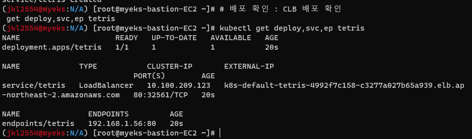  
[테트리스 배포]  

  
[NLB 배포 중]  

  
[테트리스 배포 완료]  

### ExternalDNS 사용
```
# NLB에 ExternalDNS 로 도메인 연결
kubectl annotate service tetris "external-dns.alpha.kubernetes.io/hostname=tetris.$MyDomain"

# Route53에 A레코드 확인
aws route53 list-resource-record-sets --hosted-zone-id "${MyDnsHostedZoneId}" --query "ResourceRecordSets[?Type == 'A']" | jq
aws route53 list-resource-record-sets --hosted-zone-id "${MyDnsHostedZoneId}" --query "ResourceRecordSets[?Type == 'A'].Name" | jq .[]

# 확인
dig +short tetris.$MyDomain @8.8.8.8
dig +short tetris.$MyDomain

# 도메인 체크
echo -e "My Domain Checker = https://www.whatsmydns.net/#A/tetris.$MyDomain"

# 웹 접속 주소 확인 및 접속
echo -e "Tetris Game URL = http://tetris.$MyDomain"
```

  
[명령 실행 결과]  

  
[도메인 연결 결과]  

## CoreDNS

### CoreDNS 존재 확인
```
# 디플로이먼트(파드) 확인
kubectl get deployments.apps -n kube-system
root@k8s-m:~# kubectl get deployments.apps -n kube-system
NAME                      READY   UP-TO-DATE   AVAILABLE   AGE
coredns                   2/2     2            2           30h

kubectl get pod -n kube-system -o wide -l k8s-app=kube-dns
root@k8s-m:~# kubectl get pod -n kube-system -o wide -l k8s-app=kube-dns
NAME                       READY   STATUS    RESTARTS   AGE     IP             NODE    NOMINATED NODE   READINESS GATES
coredns-558bd4d5db-629rs   1/1     Running   0          6m19s   172.16.29.23   k8s-m   <none>           <none>
coredns-558bd4d5db-z92g9   1/1     Running   1          3h50m   172.16.29.21   k8s-m   <none>           <none>

# CoreDNS 서비스(Cluster IP) 확인
kubectl get svc -n kube-system kube-dns
NAME       TYPE        CLUSTER-IP    EXTERNAL-IP   PORT(S)                  AGE
kube-dns   ClusterIP   10.200.1.10   <none>        53/UDP,53/TCP,9153/TCP   70m

# coredns 컨피그맵 확인
kubectl describe configmaps -n kube-system coredns
root@k8s-m:~# kubectl describe configmaps -n kube-system coredns
Name:         coredns
Namespace:    kube-system
Labels:       <none>
Annotations:  <none>

Data
====
Corefile:
----
.:53 {           # {플러그인 명시} - 링크
    errors       # 표준 출력으로 에러 로그 남김
    health {     # http://<Pod-IP>:8080/health 으로 CoreDNS 헬스 체크 가능
       lameduck 5s
    }
    ready        # http://<Pod-IP>8181/ready 으로 CoreDNS 준비 체크 가능
    kubernetes cluster.local in-addr.arpa ip6.arpa {   # 쿠버네티스의 Service 도메인과 POD IP 기반으로 DNS 쿼리를 응답
       pods insecure     # pods verified 는 같은 네임스페이스에 속한 파드끼리만 A 레코드에 관한 DNS 쿼리에 응답, # pods disabled 파드간 질의 불가능
       fallthrough in-addr.arpa ip6.arpa    # 도메인 찾을 시 실패했을 때 동작을 설정
       ttl 30    # ttl 설정으로 타임아웃을 제어
    }
    prometheus :9153  # http://<Pod-IP>9153/metrics 으로 프로메테우스 형식의 메트릭 정보를 제공
    forward . /etc/resolv.conf {  # 클러스터 도메인으로 설정되지 않은 DNS 쿼리를 호스트의 /etc/resolv.conf 에 설정된 외부 DNS 서버로 보내서 처리
       max_concurrent 1000
    }
    cache 30     # DNS 쿼리의 캐시 유지 시간을 30초로 설정
    loop         # 간단한 전달 루프(loop)를 감지하고, 루프가 발견되면 CoreDNS 프로세스를 중단(halt) - 링크
    reload       # Corefile 변경 감지하여 자동으로 설정 내용을 반영 (보통 2분 정도 이내)
    loadbalance  # 응답에 대하여 A, AAAA, MX 레코드의 순서를 무작위로 선정하는 라운드-로빈 방식 사용
}
```

  
[coreDNS 확인]  
### 테스트를 위해 coreDNS Pod 수량 1개로 조절

```
kubectl get pod -n kube-system -l k8s-app=kube-dns
kubectl scale deployment -n kube-system coredns --replicas=1
kubectl get pod -n kube-system -l k8s-app=kube-dns
```
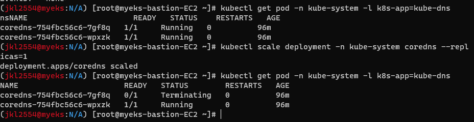  
```
# 파드 생성
kubectl run -it --rm testpod --image=nicolaka/netshoot --restart=Never -- zsh
--------------
# netpod 에서 네임서버 정보 확인 : IP는 어떤 주소인가요?
cat /etc/resolv.conf

# netpod 에서 kubernetes.io 도메인 질의 확인
nslookup -type=A kubernetes.io -debug | grep QUESTIONS -A1

# netpod 에서 kubernetes.io. (도메인 끝에 . 점 dot 있음) 절대 Absolute 도메인 질의 확인
nslookup -type=A kubernetes.io. -debug | grep QUESTIONS -A1

# netpod 에서 zsh 쉘 빠져나오기
exit
--------------
```

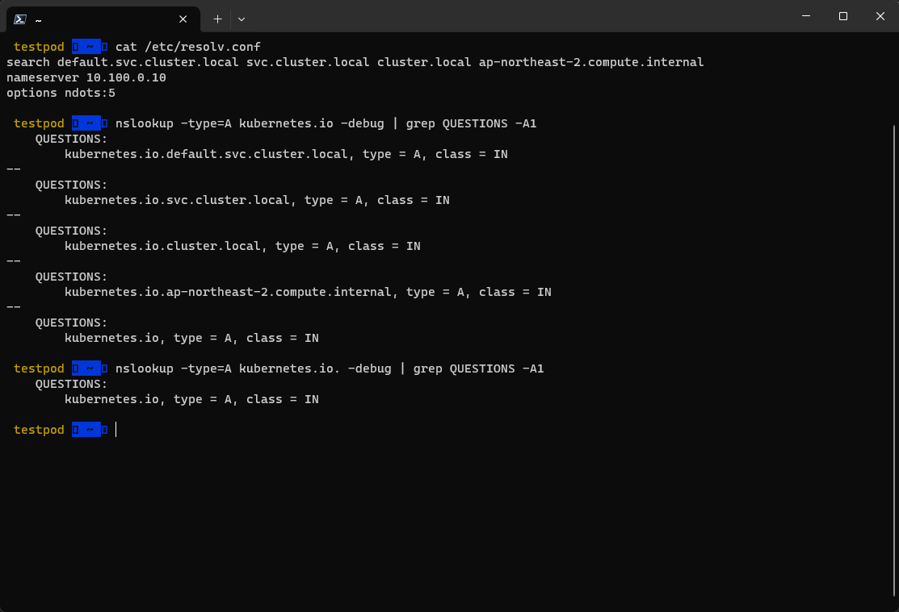  
[coreDNS 파드 네임서버 도메인 테스트]  
- 
```
cat <<EOT> svc-pod.yaml
apiVersion: apps/v1
kind: Deployment
metadata:
  name: deploy-kans
spec:
  replicas: 3
  selector:
    matchLabels:
      app: deploy-websrv
  template:
    metadata:
      labels:
        app: deploy-websrv
    spec:
      terminationGracePeriodSeconds: 0
      containers:
      - name: kans-websrv
        image: gcr.io/google-samples/kubernetes-bootcamp:v1
        ports:
        - containerPort: 8080
---
apiVersion: v1
kind: Service
metadata:
  name: svc-clusterip
spec:
  ports:
    - name: svc-webport
      port: 9000
      targetPort: 8080
  selector:
    app: deploy-websrv
  type: ClusterIP
EOT
```
```
# (옵션) 터미널1
watch -d 'kubectl get pods,svc,ep -o wide'

# 생성
kubectl apply -f svc-pod.yaml

# 서비스, 엔드포인트 확인
kubectl get svc,endpoints

# DNS 접속 테스트 파드 생성
kubectl run -it --rm netdebug --image=nicolaka/netshoot --restart=Never -- zsh
-------------
# 서비스 도메인 쿼리
nslookup svc-clusterip
...
Name:	svc-clusterip.default.svc.cluster.local
Address: 10.102.93.98

# 아래 처럼 4가지 방식의 도메인 쿼리 가능
nslookup svc-clusterip
nslookup svc-clusterip.default
nslookup svc-clusterip.default.svc
nslookup svc-clusterip.default.svc.cluster.local

# 당연히 아래 4가지 방식으로 접속 가능
curl -s svc-clusterip:9000
curl -s svc-clusterip.default:9000
curl -s svc-clusterip.default.svc:9000
curl -s svc-clusterip.default.svc.cluster.local:9000

exit
-------------
```

  
[resolv.conf]  
이 클러스터의 파드는 
```
default.svc.cluster.local
svc.cluster.local
cluster.local
ap-northeast-2.compute.internal
``` 
의 기본 도메인을 가지고 있음을 알 수 있다.  
도메인 쿼리 결과와 같은 결과가 나온다  

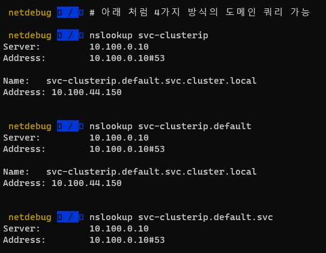  
[도메인 쿼리 결과]  

## 스테이트풀 셋 & 헤드리스 서비스

```
# 모니터링
watch -d 'kubectl get sts,pods,svc,pvc,pv'
```

```
# 스테이트풀셋 & 헤드리스서비스 배포
curl -s -O https://raw.githubusercontent.com/kubernetes/website/main/content/en/examples/application/web/web.yaml
cat web.yaml | yh
kubectl apply -f web.yaml && kubectl get pods -w -l app=nginx

# 파드 hostname 확인
for i in 0 1; do kubectl exec "web-$i" -- sh -c 'hostname'; done
kubectl df-pv

# netshoot 이미지로 netdebug 파드에 zsh 실행
kubectl run -it --rm netdebug --image=nicolaka/netshoot --restart=Never -- zsh
--------------------
nslookup nginx
nslookup -type=srv nginx
nslookup web-0.nginx
nslookup web-1.nginx
exit
--------------------
```
  
[헤드리스 배포 테스트]  

```
# 파드 삭제 실행 후 재실행 시 생성 순서 확인
kubectl delete pod -l app=nginx && kubectl get pods -w -l app=nginx
```
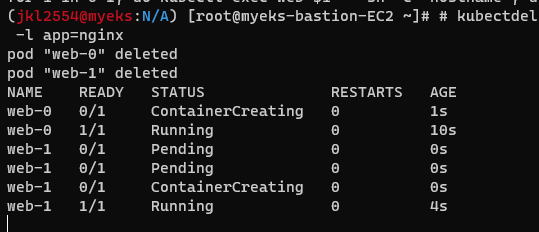  
[삭제된 파드 재실행 순서]  
```
# 파드 hostname 확인
for i in 0 1; do kubectl exec web-$i -- sh -c 'hostname'; done

# netshoot 이미지로 netdebug 파드에 zsh 실행
kubectl run -it --rm netdebug --image=nicolaka/netshoot --restart=Never -- zsh
--------------------
nslookup nginx
nslookup -type=srv nginx
nslookup web-0.nginx
nslookup web-1.nginx
exit
--------------------
```
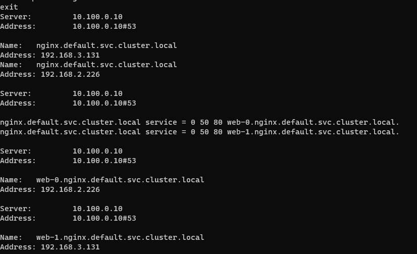  
[NS Lookup 확인]  
```
# PVC 확인
kubectl get pvc -l app=nginx
NAME        STATUS   VOLUME                                     CAPACITY   ACCESS MODES   STORAGECLASS   AGE
www-web-0   Bound    pvc-464030d6-f732-406f-aac4-dc35add63b2b   1Gi        RWO            local-path     7m6s
www-web-1   Bound    pvc-04c73836-e842-4abd-b19e-870c16b2b51c   1Gi        RWO            local-path     6m59s

# 웹 서버 index.html 에 hostname 추가 후 웹 접속 해서 확인
# 웹 서버 파드는 볼륨 마운트 정보 : Mounts: /usr/share/nginx/html from www (rw) - PersistentVolumeClaim
for i in 0 1; do kubectl exec "web-$i" -- sh -c 'echo "$(hostname)-pv-test" > /usr/share/nginx/html/index.html'; done
for i in 0 1; do kubectl exec -i -t "web-$i" -- curl http://localhost/; done
```
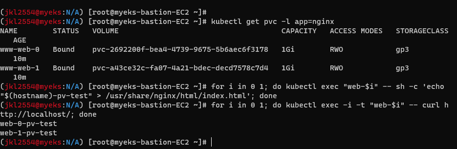
[볼륨 마운트 정보 확인]  
```
# 파드 삭제 실행 후 재실행 시 생성 순서 확인
kubectl delete pod -l app=nginx && kubectl get pods -w -l app=nginx

# 웹 접속 해서 확인 : PV 저장소 확인
for i in 0 1; do kubectl exec -i -t "web-$i" -- curl http://localhost/; done

# 파드 증가
kubectl scale sts web --replicas=5 && kubectl get pods -w -l app=nginx

# 파드 감소
kubectl patch sts web -p '{"spec":{"replicas":3}}' && kubectl get pods -w -l app=nginx

# 삭제
kubectl delete -f web.yaml && kubectl delete pvc --all
```
