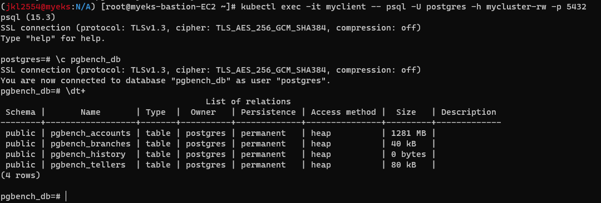

# eks pgbench 테스트 수행
## 기본 설정
### pg 설치
`[docs](https://cloudnative-pg.io/documentation/current/installation_upgrade/)`
`[cnpg plugin](https://cloudnative-pg.io/documentation/current/kubectl-plugin/#install)`
### cnpg를 통한 확인

### Grafana 모니터링

#### Deploy, StatefulSet 미 생성

#### 미 생성 이유
- StatefulSet의 단점(순서대로 배포돼 중간수정이 불가 등)이 있어, 이것까지 직접 오브젝트로 생성해 배포  


- 직접 Cluster라는 리소스를 정의해 배포한다.  


## 성능테스트
### pg 접속용 Client 생성
```
kubectl apply -f - << EOT
apiVersion: v1
kind: Pod
metadata:
  name: myclient
  labels:
    app: myclient
spec:
  containers:
  - name: myclient
    image: bitnami/postgresql:15.3.0
    command: ["tail"]
    args: ["-f", "/dev/null"]
  terminationGracePeriodSeconds: 0
EOT
```
  
### pgbench 테스트를 위한 초기화 작업

#### psql 클라이언트 접속
```
kubectl exec -it myclient -- psql -U postgres -h mycluster-rw -p 5432
```
  

#### Banch test용 DB생성
```
CREATE DATABASE pgbench_db; ## Database 생성
\q ## 쉘 나가기
```

#### 초기화 명령 수행
```
kubectl cnpg pgbench \
  -n default mycluster \
  --job-name pgbench-job \
  --db-name pgbench_db \
  -- -i -U postgres
```
##### 초기화 결과
  
  
##### 테이블목록

##### 테이블 사이즈


#### 테스트를 위한 테이블 사이즈 용량이 너무 작아 스케일링 수행

```
kubectl cnpg pgbench \
  -n default mycluster \
  --job-name pgbench-job \
  --db-name pgbench_db \
  -- -i -U postgres -s 100 ## 100배 Scaling
```
##### job 완료


##### 테이블 사이즈 확인
  
### pgbench 수행
```
kubectl cnpg pgbench \
  -n default mycluster \
  --job-name pgbench-run \
  --db-name pgbench_db \
  -- -U postgres --time 30 --client 3
```
#### 테스트 결과
##### 테스트 결과
  
#### 결과 분석
- 레이턴시: 13.342 ms
- 초기 연결 시간: 245.140 ms
- TPS: 224.850879
#### 가상머신 사이즈


#### Azure postgresql Server 테스트용 서버와 비교

```
## pg bench 초기화
pgbench -h pgbench-hyugo.postgres.database.azure.com -p 5432 -i -U testadm -s 100 pgbench_db

##### 초기화 결과


## 테스트 수행
pgbench -h pgbench-hyugo.postgres.database.azure.com -p 5432 -U testadm pgbench_db --time 30 --client 3
```
##### 테스트 결과


#### 결과 분석
- 레이턴시: 452.123 ms
- 초기 연결 시간: 1201.987 ms
- TPS: 6.635359
#### Azure postgreSQL 사이즈

### 비교 분석
- 공인망 접속으로 인한 레이턴시, 초기 연결 시간 문제(TLS)
- TPS는 훨씬 빠르다.
- 동일 서브넷 환경에서는 더 높은 성능이 예상됨

### fio 성능 테스트
##### pvc 확인

```
kubectl cnpg fio fio-run \
  -n default  \
  --storageClass gp3 \
  --pvcSize 3Gi
```

```
## service로 expose
## kubectl expose deploy fio-run --type LoadBalancer --name fio-run-svc --port 80 --target-port 8000 ## private subnet에 배포됨
kubectl apply -f - <<EOF
apiVersion: v1
kind: Service
metadata:
  name: fio-run-svc
  annotations:
    service.beta.kubernetes.io/aws-load-balancer-scheme: "internet-facing"
spec:
  type: LoadBalancer
  selector:
    app.kubernetes.io/instance: fio-run
    app.kubernetes.io/name: fio
  ports:
  - port: 80
    protocol: TCP
    targetPort: 8000
EOF
```

##### 서비스
  
##### 결과 페이지
  
##### average IOPS

##### 배포된 gp3 IOPS


#### 결과 분석
- 배포된 gp3의 iops만큼 fio를 통해 iops가 확인된다.