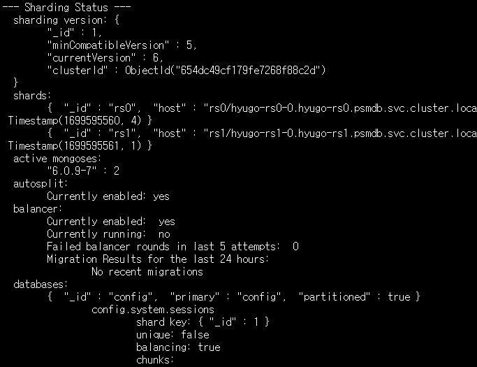

<!--more-->
# DOIK 4주차 mongoDB
```sh
MYNICK=hyugo
kubectl get secret $MYNICK-secrets
curl -s -O https://raw.githubusercontent.com/gasida/DOIK/main/psmdb/cluster2.yaml
cat cluster2.yaml | yh
cat cluster2.yaml | sed -e "s/my-cluster-name/$MYNICK/" | kubectl apply -f -
# CRD 설치
kubectl apply --server-side -f https://raw.githubusercontent.com/gasida/DOIK/main/psmdb/crd.yaml
kubectl get crd | grep psmdb
kubectl create ns psmdb
kubectl get pod
## DaemonSet 배포
curl -s -O https://raw.githubusercontent.com/gasida/DOIK/main/psmdb/myclient.yaml
cat myclient.yaml | yh
#VERSION=4.4.24-23 envsubst < myclient.yaml | kubectl apply -f -
sed 's/${VERSION}/4.4.24-23/g' myclient.yaml | kubectl apply -f -

kubectl get pod -l name=mongodb -owide

# kubectl ns psmdb       # 꼭! 꼭! psmdb 로 네임스페이스 변경을 하시고 실습 진행을 하셔야 됩니다!
kubectl config set-context --current --namespace=psmdb

kubectl get pod
kube config get-contexts
kubectl config get-contexts
kubectl config set-namespace ns psmdb
kubectl config --help
kubectl config set-context namespace=psmdb
kubectl config get-contexts
kubectl config remove-context namespace=psmdb
kubectl config delete-context namespace=psmdb
kubectl config set-context --help
kubectl config set-context --namespace=psmdb
kubectl config set-context --current --namespace=psmdb
kubectl get po
echo $MYNICK

curl -s -O https://raw.githubusercontent.com/gasida/DOIK/main/psmdb/secrets.yaml
export MYNICK=$MYNICK
cat secrets.yaml | yh
cat secrets.yaml | sed -e "s/my-cluster-name/$MYNICK/" | kubectl apply -f -
cat secrets.yaml
kubectl get secret $MYNICK-secrets
kubectl get secret $MYNICK-secrets -o json | jq .data
kubectl get secret $MYNICK-secrets
curl -s -O https://raw.githubusercontent.com/gasida/DOIK/main/psmdb/cluster2.yaml
cat cluster2.yaml | yh
cat cluster2.yaml | sed -e "s/my-cluster-name/$MYNICK/" | kubectl apply -f -
kubectl get psmdb
yh
wget https://github.com/andreazorzetto/yh/releases/download/v0.4.0/yh-linux-amd64.zip
unzip yh-linux-amd64.zip 
mv yh /usr/local/bin/
yh
import PATH
export PATH
echo $PATH
mv yh ./.local/bin/
mv yh ./.local/bin
cd .local/
ls
mv bin yh
cd ~
ls
mkdir --help
mkdir -p ./.local/bin/
mv yh ./.local/bin/yh
mv .local/yh ./.local/bin/yh
yh
kubectl krew install neat
(   set -x; cd "$(mktemp -d)" &&   OS="$(uname | tr '[:upper:]' '[:lower:]')" &&   ARCH="$(uname -m | sed -e 's/x86_64/amd64/' -e 's/\(arm\)\(64\)\?.*/\1\2/' -e 's/aarch64$/arm64/')" &&   KREW="krew-${OS}_${ARCH}" &&   curl -fsSLO "https://github.com/kubernetes-sigs/krew/releases/latest/download/${KREW}.tar.gz" &&   tar zxvf "${KREW}.tar.gz" &&   ./"${KREW}" install krew; )
export PATH="${KREW_ROOT:-$HOME/.krew}/bin:$PATH"
kubectl krew install neat

kubectl get psmdb $MYNICK -o yaml | kubectl neat | yh
kubectl get sts,pod -owide
kubectl get svc,ep
kubectl df-pv
kubectl get pvc,pv
kubectl get secret $MYNICK-secrets
kubectl get psmdb
kubectl get sts,pod -owid
kubectl get sts,pod -owide
kubectl get sts,pod -owide -n default
kubectl get sts,pod -owide
kubectl get psmdb status
kubectl psmdb  status
kubectl get psmdb status
kubectl get psmdb 
kubectl describe psmdb
cat cluster2.yaml | yh
kubectl get psmd
kubectl get psmdb
kubectl apply -f https://raw.githubusercontent.com/gasida/DOIK/main/psmdb/rbac.yaml
kubectl get-all -n psmdb
# 오퍼레이터 설치
curl -s -O https://raw.githubusercontent.com/gasida/DOIK/main/psmdb/operator.yaml
cat operator.yaml | yh
kubectl apply -f operator.yaml
kubectl get deploy,pod
kubectl get-all -n psmdb
kubectl get deploy,pod
kubectl get svc,ep $MYNICK-mongos





```

