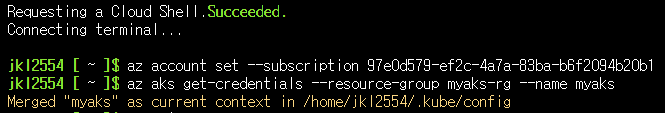
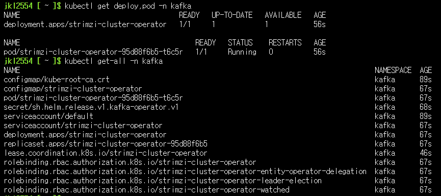
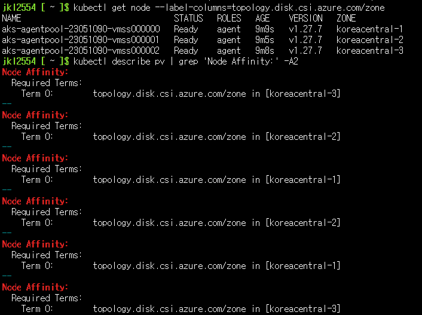
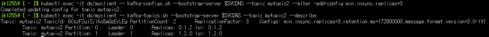

# DOIK 5주차 Kafka
*이번 실습은 Azure AKS에서 수행해 보았습니다. 

## AKS cluseter 배포
### 배포정보
- Public Cluster로 배포
- Azure CNI
- Kubernetes RBAC사용
- Node 3개
- kubernetes version 1.27.7
- node sku: Standard_B2s
- Cloud Shell 에서 배포 수행
- [Azure Cloud Shell 기본 설치 도구](https://learn.microsoft.com/ko-kr/azure/cloud-shell/features#pre-installed-tools)
- 기타 설치 도구(.local/bin/): envsubst, yh
```sh
## 로컬 bin디렉토리 생성
mkdir -p .local/bin/
## envsubst 설치
curl -L https://github.com/a8m/envsubst/releases/download/v1.2.0/envsubst-`uname -s`-`uname -m` -o envsubst
chmod +x envsubst
mv envsubst .local/bin/
## yh 설치
curl -L https://github.com/andreazorzetto/yh/releases/download/v0.4.0/yh-linux-amd64.zip -o yh-linux-amd64.zip && unzip yh-linux-amd64.zip && rm yh-linux-amd64.zip
mv yh .local/bin/

## tree 설치
curl -L https://mama.indstate.edu/users/ice/tree/src/tree-2.1.1.tgz -o tree-2.1.1.tgz
tar xzfv tree-2.1.1.tgz && cd tree-2.1.1/
make && make install DESTDIR=$HOME/.local/bin/ MANDIR=$HOME/.local/man/
cd $HOME && rm -rf tree-2.1.1/ tree-2.1.1.tgz

```
- 기타 설치 도구(export PATH="$HOME/.krew/bin:$PATH"): krew, ctx, ns, get-all, df-pv, neat, resource-capacity
```sh
## krew install
(
  set -x; cd "$(mktemp -d)" &&
  OS="$(uname | tr '[:upper:]' '[:lower:]')" &&
  ARCH="$(uname -m | sed -e 's/x86_64/amd64/' -e 's/\(arm\)\(64\)\?.*/\1\2/' -e 's/aarch64$/arm64/')" &&
  KREW="krew-${OS}_${ARCH}" &&
  curl -fsSLO "https://github.com/kubernetes-sigs/krew/releases/latest/download/${KREW}.tar.gz" &&
  tar zxvf "${KREW}.tar.gz" &&
  ./"${KREW}" install krew
)

export PATH="${KREW_ROOT:-$HOME/.krew}/bin:$PATH"
echo "export PATH="${KREW_ROOT:-$HOME/.krew}/bin:$PATH"" >> ~/.bashrc

kubectl krew install ctx ns get-all df-pv neat resource-capacity
kubectl krew list
```
[krew list]  
  
[AKS 배포 정보]  
  
[배포된 리소스 정보]  
  
```sh
### AKS 연결 수행
az account set --subscription <Your Subscripton ID>
az aks get-credentials --resource-group myaks-rg --name myaks

```
[AKS 연결]  
  
  
## Kafka 배포
### 오퍼레이터 배포
```sh
# 네임스페이스 생성
kubectl create namespace kafka

# Repo 추가
helm repo add strimzi https://strimzi.io/charts/
helm show values strimzi/strimzi-kafka-operator

# 차트 설치 : 오퍼레이터 파드 설치
helm install kafka-operator strimzi/strimzi-kafka-operator --version 0.38.0 --namespace kafka
```
#### 설치 확인
```sh
# 배포한 리소스 확인 : Operator 디플로이먼트(파드)
kubectl get deploy,pod -n kafka
kubectl get-all -n kafka

```
[카프카 오퍼레이터 배포]  

### kafka클러스터 배포
```sh
curl -s -O https://raw.githubusercontent.com/gasida/DOIK/main/strimzi/kafka-1.yaml
cat kafka-1.yaml | yh
```
현재 토폴로지 키 정보가 "topology.ebs.csi.aws.com/zone"으로 설정 돼 있으나 Azure에서는"topology.disk.csi.azure.com/zone" 토폴로지로 사용해야함.
```yaml
apiVersion: kafka.strimzi.io/v1beta2
kind: Kafka
metadata: 
  name: my-cluster
spec: 
  kafka: 
    version: 3.6.0
    replicas: 3
    listeners: 
      - name: plain
        port: 9092
        type: internal
        tls: false
      - name: tls
        port: 9093
        type: internal
        tls: false
      - name: external
        port: 9094
        type: nodeport
        tls: false
    readinessProbe: 
      initialDelaySeconds: 15
      timeoutSeconds: 5
    livenessProbe: 
      initialDelaySeconds: 15
      timeoutSeconds: 5
    config: 
      offsets.topic.replication.factor: 3
      transaction.state.log.replication.factor: 3
      transaction.state.log.min.isr: 2
      default.replication.factor: 3
      min.insync.replicas: 2
      inter.broker.protocol.version: "3.6"
    storage: 
      type: jbod
      volumes: 
      - id: 0
        type: persistent-claim
        size: 10Gi
        deleteClaim: true
    template: 
      pod: 
        affinity: 
          podAntiAffinity: 
            requiredDuringSchedulingIgnoredDuringExecution: 
              - labelSelector: 
                  matchExpressions: 
                    - key: app.kubernetes.io/name
                      operator: In
                      values: 
                        - kafka
                topologyKey: "topology.ebs.csi.aws.com/zone" ## 변경 필요
  zookeeper: 
    replicas: 3
    readinessProbe: 
      initialDelaySeconds: 15
      timeoutSeconds: 5
    livenessProbe: 
      initialDelaySeconds: 15
      timeoutSeconds: 5
    storage: 
      type: persistent-claim
      size: 10Gi
      deleteClaim: true
    template: 
      pod: 
        affinity: 
          podAntiAffinity: 
            requiredDuringSchedulingIgnoredDuringExecution: 
              - labelSelector: 
                  matchExpressions: 
                    - key: app.kubernetes.io/name
                      operator: In
                      values: 
                        - zookeeper
                topologyKey: "topology.ebs.csi.aws.com/zone" ## 변경 필요
  entityOperator: 
    topicOperator: {}
    userOperator: {}
```

#### 토폴로지 변경 및 배포 
```sh
sed 's/\"topology.ebs.csi.aws.com\/zone\"/\"topology.disk.csi.azure.com\/zone\"/g' kafka-1.yaml | kubectl apply -f - -n kafka
```
#### 배포 리소스 확인
```sh
# 배포된 리소스들 확인
kubectl get-all -n kafka
```

```sh
# 배포된 리소스 확인 : 주키퍼 설치 완료 후 >> 카프카 브로커 설치됨
kubectl get kafka -n kafka
kubectl get cm,secret -n kafka
```
  

```sh

# 배포된 리소스 확인 : 카프카/주키퍼 strimzipodsets 생성 확인 >> sts 스테이트풀렛 사용 X
kubectl get strimzipodsets -n kafka
```
  

```sh
# 노드 정보 확인
kubectl describe node | more
kubectl get node --label-columns=topology.disk.csi.azure.com/zone
kubectl describe pv | grep 'Node Affinity:' -A2
```
  


```sh

# 배포된 리소스 확인 : 배포된 파드 생성 확인
kubectl get pod -n kafka -l app.kubernetes.io/name=kafka
kubectl get pod -n kafka -l app.kubernetes.io/name=zookeeper
kubectl get pod -n kafka -l app.kubernetes.io/instance=my-cluster
```
  
```sh
# 배포된 리소스 확인 : 서비스 Service(Headless) 등 생성 확인 - listeners(3개)
kubectl get svc,endpointslice -n kafka
```
  
```sh
# 배포된 리소스 확인 : 카프카/주키퍼 파드 저장소 확인
kubectl get pvc,pv -n kafka
kubectl df-pv
```
  
```sh
# 배포된 리소스 확인 : 컨피그맵 확인
kubectl get cm -n kafka
# 컨피그맵 상세 확인
kubectl describe cm -n kafka strimzi-cluster-operator
kubectl describe cm -n kafka my-cluster-zookeeper-config
kubectl describe cm -n kafka my-cluster-entity-topic-operator-config
kubectl describe cm -n kafka my-cluster-entity-user-operator-config
kubectl describe cm -n kafka my-cluster-kafka-0
kubectl describe cm -n kafka my-cluster-kafka-1
kubectl describe cm -n kafka my-cluster-kafka-2
```
  
```sh

# kafka 클러스터 Listeners 정보 확인 : 각각 9092 평문, 9093 TLS, 세번째 정보는 External 접속 시 NodePort 정보
kubectl get kafka -n kafka my-cluster -o jsonpath={.status.listeners} | jq
```
  
```sh
# (옵션) NetworkPolicy 확인 >> 어떤 동작을 처리하는가?
kubectl get networkpolicy -n kafka
kubectl describe networkpolicy -n kafka

# (옵션) poddisruptionbudget 확인 >> 어떤 동작을 처리하는가?
kubectl get pdb -n kafka
kubectl describe pdb -n kafka

```
#### 카프카 클러스터 정보 확인
```sh
# 파일 다운로드
curl -s -O https://raw.githubusercontent.com/gasida/DOIK/main/strimzi/myclient.yaml
cat myclient.yaml | yh

# 데몬셋으로 myclient 파드 배포 : 어떤 네임스페이스에 배포되는가? -> Default 
VERSION=3.6 envsubst < myclient.yaml | kubectl apply -f -
kubectl get pod -l name=kafkaclient -owide
```
  
```sh
# Kafka client 에서 제공되는 kafka 관련 도구들 확인
kubectl exec -it ds/myclient -- ls /opt/bitnami/kafka/bin
```
  
```sh
# 카프카 파드의 SVC 도메인이름을 변수에 지정
SVCDNS=my-cluster-kafka-bootstrap.kafka.svc:9092
# echo "export SVCDNS=my-cluster-kafka-bootstrap.kafka.svc:9092" >> /etc/profile
echo "export SVCDNS=my-cluster-kafka-bootstrap.kafka.svc:9092" >> .bashrc
```
```sh
# 브로커 정보
kubectl exec -it ds/myclient -- kafka-broker-api-versions.sh --bootstrap-server $SVCDNS
# 브로커에 설정된 각종 기본값 확인 : --broker --all --describe 로 조회
kubectl exec -it ds/myclient -- kafka-configs.sh --bootstrap-server $SVCDNS --broker 1 --all --describe
kubectl exec -it ds/myclient -- kafka-configs.sh --bootstrap-server $SVCDNS --broker 2 --all --describe
kubectl exec -it ds/myclient -- kafka-configs.sh --bootstrap-server $SVCDNS --broker 0 --all --describe
```
  
  
```sh
# 토픽 리스트 확인
kubectl exec -it ds/myclient -- kafka-topics.sh --bootstrap-server $SVCDNS --list

# 토픽 리스트 확인 (kubectl native) : PARTITIONS, REPLICATION FACTOR
kubectl get kafkatopics -n kafka
```
  

```sh
# 배포
helm repo add kafka-ui https://provectus.github.io/kafka-ui-charts
cat <<EOF > kafkaui-values.yml
yamlApplicationConfig:
  kafka:
    clusters:
      - name: yaml
        bootstrapServers: my-cluster-kafka-bootstrap.kafka.svc:9092
  auth:
    type: disabled
  management:
    health:
      ldap:
        enabled: false
EOF

# 설치
helm install kafka-ui kafka-ui/kafka-ui -f kafkaui-values.yml

# 접속 확인
kubectl patch svc kafka-ui -p '{"spec":{"type":"LoadBalancer"}}'
# kubectl annotate service kafka-ui "external-dns.alpha.kubernetes.io/hostname=kafka-ui.$MyDomain"
# echo -e "kafka-ui Web URL = http://kafka-ui.$MyDomain"
kubectl get svc kafka-ui
```
  
  

#### 모니터링 설치 (grafana, prometheus)
```sh
# exporter 관련 설정 확인
curl -s -O https://raw.githubusercontent.com/gasida/DOIK/main/strimzi/kafka-2.yaml
cat kafka-2.yaml | yh

# exporter 설정된 카프카 클러스터 배포
# kubectl apply -f kafka-2.yaml -n kafka
sed 's/\"topology.ebs.csi.aws.com\/zone\"/\"topology.disk.csi.azure.com\/zone\"/g' kafka-2.yaml | kubectl apply -f - -n kafka

# 예제 코드 복사
git clone https://github.com/AmarendraSingh88/kafka-on-kubernetes.git
cd kafka-on-kubernetes/kafka-demo/demo3-monitoring/
tree

```
  
```sh
kubectl create ns monitoring
# 프로메테우스 설치 : --server-side 는 왜 쓸까요? 안쓰면 어떻게 될까요?
kubectl apply -f prometheus-operator-deployment.yaml -n monitoring --server-side
kubectl apply -f prometheus.yaml -n monitoring
kubectl apply -f prometheus-rules.yaml -n monitoring
kubectl apply -f strimzi-pod-monitor.yaml -n monitoring
```


```sh
# 그라파나 설치
kubectl apply -f grafana/grafana.yaml -n monitoring
kubectl patch svc -n monitoring grafana -p '{"spec":{"type":"LoadBalancer"}}'
# kubectl annotate service grafana -n monitoring "external-dns.alpha.kubernetes.io/hostname=grafana.$MyDomain"

# 접속 정보 확인
# echo -e "Grafana URL = http://grafana.$MyDomain:3000"
kubectl get svc -n monitoring grafana
```
  
[그라파나 소스 설정:`prometheus-prometheus-0.prometheus-operated.monitoring.svc.cluster.local:9090`]  
  
[그라파나 대시보드 추가]  
  
  
## Kafka 토픽 생성 및 메시지 주고받기
### 토픽 생성
```sh
curl -s -O https://raw.githubusercontent.com/gasida/DOIK/main/3/mytopic.yaml
cat mytopic.yaml | yh
TOPICNAME=mytopic1 envsubst < mytopic.yaml | kubectl apply -f - -n kafka
```
#### mytopic.yaml
```yaml
apiVersion: kafka.strimzi.io/v1beta2
kind: KafkaTopic
metadata:
  name: ${TOPICNAME}
  labels:
    strimzi.io/cluster: "my-cluster"
spec:
  partitions: 1
  replicas: 3
  config:
    retention.ms: 7200000
    segment.bytes: 1073741824
    min.insync.replicas: 2
```
```sh
# 토픽 생성 확인 (kubectl native)
kubectl get kafkatopics -n kafka

kubectl exec -it ds/myclient -- kafka-topics.sh --bootstrap-server $SVCDNS --list | grep mytopic

```
  
  

```sh
# 토픽 상세 정보 확인 : 설정값 미 지정 시 기본값이 적용
kubectl exec -it ds/myclient -- kafka-topics.sh --bootstrap-server $SVCDNS --topic mytopic1 --describe
```
  

```sh
# 토픽 Topic 생성 : 파티션 1개 리플리케이션 3개
kubectl exec -it ds/myclient -- kafka-topics.sh --create --bootstrap-server $SVCDNS --topic mytopic2 --partitions 1 --replication-factor 3 --config retention.ms=172800000

# 토픽 생성 확인
kubectl get kafkatopics -n kafka
```
  
```sh
# 토픽 상세 정보 확인
kubectl exec -it ds/myclient -- kafka-topics.sh --bootstrap-server $SVCDNS --topic mytopic2 --describe
```
  

```sh
# 토픽의 파티션 갯수 늘리기
kubectl exec -it ds/myclient -- kafka-topics.sh --bootstrap-server $SVCDNS --topic mytopic2 --alter --partitions 2
kubectl exec -it ds/myclient -- kafka-topics.sh --bootstrap-server $SVCDNS --topic mytopic2 --describe
```
  
  
```sh
# 토픽의 파티션 갯수 줄이기(안됨)
kubectl exec -it ds/myclient -- kafka-topics.sh --bootstrap-server $SVCDNS --topic mytopic2 --alter --partitions 1
```
  
```sh
# 토픽 일부 옵션 설정 : min.insync.replicas=2 를 min.insync.replicas=3 으로 수정
kubectl exec -it ds/myclient -- kafka-configs.sh --bootstrap-server $SVCDNS --topic mytopic2 --alter -add-config min.insync.replicas=3
kubectl exec -it ds/myclient -- kafka-topics.sh --bootstrap-server $SVCDNS --topic mytopic2 --describe
kubectl exec -it ds/myclient -- kafka-configs.sh --bootstrap-server $SVCDNS --topic mytopic2 --alter -add-config min.insync.replicas=2
```
  

### 토픽 메시지 보내고 받기
#### 토픽 모니터링
```sh
watch -d kubectl get kafkatopics -n kafka
```
  
#### 사용 스크립트 (참고)
```sh
kafka-console-producer.sh
kafka-console-consumer.sh
```
#### 실습
```sh
# 토픽에 데이터 넣어보기
kubectl exec -it ds/myclient -- kafka-console-producer.sh --bootstrap-server $SVCDNS --topic mytopic1

# 데이터 입력 후 CTRL+D 로 빠져나오기
```
  
```sh
# 토픽 데이터 확인
kubectl exec -it ds/myclient -- kafka-console-consumer.sh --bootstrap-server $SVCDNS --topic mytopic1 --from-beginning
# 데이터 확인 후 CTRL+C 로 빠져나오기
```
  
```sh
# 토픽에 데이터(메시지키+메시지값) 넣어보기
kubectl exec -it ds/myclient -- kafka-console-producer.sh --bootstrap-server $SVCDNS --topic mytopic1 --property "parse.key=true" --property "key.separator=:"
# 데이터 입력 후 CTRL+D 로 빠져나오기
```
  
```sh
# 토픽에 데이터(메시지키+메시지값) 확인
kubectl exec -it ds/myclient -- kafka-console-consumer.sh --bootstrap-server $SVCDNS --topic mytopic1 --property print.key=true --property key.separator="-" --from-beginning
# 데이터 확인 후 CTRL+C 로 빠져나오기
```
  
```sh
# 토픽에 데이터 최대 컨슘 메시지 갯수 확인
kubectl exec -it ds/myclient -- kafka-console-consumer.sh --bootstrap-server $SVCDNS --topic mytopic1 --max-messages 2 --from-beginning
```

```sh

# 토픽에서 특정 파티션만 컨슘 확인
kubectl exec -it ds/myclient -- kafka-console-consumer.sh --bootstrap-server $SVCDNS --topic mytopic1 --partition 0 --from-beginning
# 데이터 확인 후 CTRL+C 로 빠져나오기
```
  
```sh
# 토픽 삭제 (kubectl native)
kubectl delete kafkatopics -n kafka mytopic1
```
### 컨슈머 그룹
#### 사용 스크립트 (참고)
```sh
kafka-consumer-groups.sh
```
#### 실습
```sh
# 토픽에 데이터 넣어보기
kubectl exec -it ds/myclient -- kafka-console-producer.sh --bootstrap-server $SVCDNS --topic mytopic2 <<EOF
101
102
103
104
105
106
107
108
109
110
EOF

kubectl exec -it ds/myclient -- kafka-console-producer.sh --bootstrap-server $SVCDNS --topic mytopic2 <<EOF
AAA
BBB
CCC
DDD
EOF

# 컨슈머 그룹 확인
kubectl exec -it ds/myclient -- kafka-consumer-groups.sh --bootstrap-server $SVCDNS --list
```
  
```sh
# 컨슈머 그룹 기반으로 동작, 특정 목적을 가진 컨슈머들을 묶음으로 사용하는 것. 컨슈머그룹으로 토픽의 레코드를 가져갈 경우 어느 레코드까지 읽었는지에 대한 데이터가 브로커에 저장됨
## 컨슈머 그룹은 따로 생성하는 명령을 적용하는 것이 아니라, 컨슈머를 동작할 때 컨슈머 그룹이름을 지정하면 새로 생성됨
kubectl exec -it ds/myclient -- kafka-console-consumer.sh --bootstrap-server $SVCDNS --topic mytopic2 --group mygroup --from-beginning
```
  
```sh
# 컨슈머 그룹 상태 확인
## 파티션 번호, 현재까지 가져간 레코드의 오프셋, 파티션 마지막 레코드의 오프셋, 컨슈머 랙 LAG, 컨슈머 ID, 호스트 정보 확인 가능
kubectl exec -it ds/myclient -- kafka-consumer-groups.sh --bootstrap-server $SVCDNS --group mygroup --describe
```
  
```sh
# 오프셋 리셋 : 가능한 이유? >> 컨슈머는 유연하게 메시지를 가져갈 수 있다!
kubectl exec -it ds/myclient -- kafka-consumer-groups.sh --bootstrap-server $SVCDNS --group mygroup --topic mytopic2 --reset-offsets --to-earliest --execute
```
  
```sh
# 다시 컨슈머 그룹 상태 확인 : LAG 확인됨!
kubectl exec -it ds/myclient -- kafka-consumer-groups.sh --bootstrap-server $SVCDNS --group mygroup --describe
```
  
```sh
# 모니터링(new terminal)
while true; do kubectl exec -it ds/myclient -- kafka-consumer-groups.sh --bootstrap-server $SVCDNS --group mygroup --describe;echo "-----"; sleep 0.5; done

# 컨슈머 그룹 메시지 소비하기 : LAG 확인!
kubectl exec -it ds/myclient -- kafka-console-consumer.sh --bootstrap-server $SVCDNS --topic mytopic2 --group mygroup
# 다시 컨슈머 그룹 상태 확인 : LAG 0 확인!, CONSUMER-ID 확인!
kubectl exec -it ds/myclient -- kafka-consumer-groups.sh --bootstrap-server $SVCDNS --group mygroup --describe
```
  

### 로그 세그먼트
```sh
# 파드와 노드 매칭 확인
kubectl get pod -n kafka -owide | grep kafka
```
  
```sh
# 카프카 설정 확인
kubectl describe cm -n kafka my-cluster-kafka-config
...
##########
# Kafka message logs configuration  >> 로그 디렉터리
##########
log.dirs=/var/lib/kafka/data-0/kafka-log${STRIMZI_BROKER_ID}

# 로그 저장소 확인 : 특정 토픽(파티션 개수에 따른 폴더 생성됨)에 세그먼트 확인
kubectl exec -it -n kafka my-cluster-kafka-0 -c kafka -- ls -al /var/lib/kafka/data-0/kafka-log0
kubectl exec -it -n kafka my-cluster-kafka-0 -c kafka -- ls -al /var/lib/kafka/data-0/kafka-log0/mytopic2-0
kubectl exec -it -n kafka my-cluster-kafka-1 -c kafka -- ls -al /var/lib/kafka/data-0/kafka-log1
kubectl exec -it -n kafka my-cluster-kafka-2 -c kafka -- ls -al /var/lib/kafka/data-0/kafka-log2
drwxr-xr-x     - ubuntu  3 Jun 10:30  └── kafka-log2
...
.rw-r--r--     4 ubuntu  4 Jun 00:23     ├── cleaner-offset-checkpoint
.rw-r--r--     4 ubuntu  4 Jun 01:31     ├── log-start-offset-checkpoint
.rw-r--r--    88 ubuntu  3 Jun 22:48     ├── meta.properties
drwxr-xr-x     - ubuntu  4 Jun 00:34     ├── mytopic2-0
.rw-r--r--   10M ubuntu  4 Jun 00:43     │  ├── 00000000000000000000.index
.rw-r--r--  105k ubuntu  4 Jun 00:43     │  ├── 00000000000000000000.log
.rw-r--r--   10M ubuntu  4 Jun 00:43     │  ├── 00000000000000000000.timeindex
.rw-r--r--     8 ubuntu  4 Jun 00:34     │  ├── leader-epoch-checkpoint
.rw-r--r--    43 ubuntu  3 Jun 23:56     │  └── partition.metadata
drwxr-xr-x     - ubuntu  4 Jun 00:34     ├── mytopic2-1
.rw-r--r--   10M ubuntu  4 Jun 00:38     │  ├── 00000000000000000000.index
.rw-r--r--  5.2k ubuntu  4 Jun 00:43     │  ├── 00000000000000000000.log
.rw-r--r--   10M ubuntu  4 Jun 00:38     │  ├── 00000000000000000000.timeindex
.rw-r--r--     8 ubuntu  4 Jun 00:34     │  ├── leader-epoch-checkpoint
.rw-r--r--    43 ubuntu  3 Jun 23:58     │  └── partition.metadata
.rw-r--r--  1.3k ubuntu  4 Jun 01:31     ├── recovery-point-offset-checkpoint
.rw-r--r--  1.3k ubuntu  4 Jun 01:32     └── replication-offset-checkpoint


# xxd 툴로 00000000000000000000.log 의 hexdump 내용 확인 : 보낸 메시지 내용 확인, 로그 파일에 저장된 메시지는 컨슈머가 읽어갈 수 있음
kubectl exec -it -n kafka my-cluster-kafka-0 -c kafka -- cat /var/lib/kafka/data-0/kafka-log0/mytopic2-0/00000000000000000000.log | xxd
...
00000040: 0001 0a68 656c 6c6f 0000 0000 0000 0000  ...hello........
00000050: 0100 0000 3d00 0000 0002 5259 97e5 0000  ....=.....RY....
00000060: 0000 0000 0000 0181 2536 7afb 0000 0181  ........%6z.....
00000070: 2536 7afb 0000 0000 0000 03e8 0000 0000  %6z.............
00000080: 0001 0000 0001 1600 0000 010a 776f 726c  ............worl
00000090: 6400 0000 0000 0000 0002 0000 0039 0000  d............9..
```

