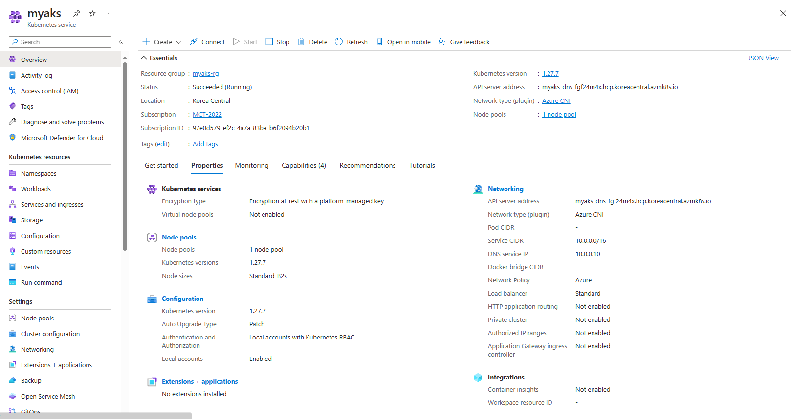

# DOIK 5주차 Kafka
*이번 실습은 Azure AKS에서 수행해 보았습니다. 

## AKS cluseter 배포
### 배포정보
- Public Cloud로 배포
- Azure CNI
- Enable RBAC & Kubernetes RBAC사용
- Cloud Shell 에서 배포 수행
- [Azure Cloud Shell 기본 설치 도구](https://learn.microsoft.com/ko-kr/azure/cloud-shell/features#pre-installed-tools)
- 기타 설치 도구(.local/bin): envsubst, yh, kubectl-get_all, kubectl-krew, kubectl-neat
- 기타 설치 도구(export PATH="$HOME/.krew/bin:$PATH"): kubectl-get_all, kubectl-krew, kubectl-neat
- 본 블로그 포스팅을 통해 AKS배포 및 agic, ingress controller배포 [Azure AKS ExernalDNS 설치](/post/azure_external_dns/)  
[AKS 배포 정보]  
  
[배포된 리소스 정보]  
  
## Kafka 배포
### 오퍼레이터 배포
```sh
# 네임스페이스 생성
kubectl create namespace kafka

# Repo 추가
helm repo add strimzi https://strimzi.io/charts/
helm show values strimzi/strimzi-kafka-operator

# 차트 설치 : 오퍼레이터 파드 설치
helm install kafka-operator strimzi/strimzi-kafka-operator --version 0.38.0 --namespace kafka
```
#### 설치 확인
```sh
# 배포한 리소스 확인 : Operator 디플로이먼트(파드)
kubectl get deploy,pod -n kafka
kubectl get-all -n kafka

```
[카프카 오퍼레이터 배포]  
  
### kafka클러스터 배포
```sh
curl -s -O https://raw.githubusercontent.com/gasida/DOIK/main/strimzi/kafka-1.yaml
cat kafka-1.yaml | yh
```
현재 토폴로지 키 정보가 "topology.ebs.csi.aws.com/zone"으로 설정 돼 있으나 Azure에서는"topology.disk.csi.azure.com/zone" 토폴로지로 사용해야함.
```yaml
apiVersion: kafka.strimzi.io/v1beta2
kind: Kafka
metadata: 
  name: my-cluster
spec: 
  kafka: 
    version: 3.6.0
    replicas: 3
    listeners: 
      - name: plain
        port: 9092
        type: internal
        tls: false
      - name: tls
        port: 9093
        type: internal
        tls: false
      - name: external
        port: 9094
        type: nodeport
        tls: false
    readinessProbe: 
      initialDelaySeconds: 15
      timeoutSeconds: 5
    livenessProbe: 
      initialDelaySeconds: 15
      timeoutSeconds: 5
    config: 
      offsets.topic.replication.factor: 3
      transaction.state.log.replication.factor: 3
      transaction.state.log.min.isr: 2
      default.replication.factor: 3
      min.insync.replicas: 2
      inter.broker.protocol.version: "3.6"
    storage: 
      type: jbod
      volumes: 
      - id: 0
        type: persistent-claim
        size: 10Gi
        deleteClaim: true
    template: 
      pod: 
        affinity: 
          podAntiAffinity: 
            requiredDuringSchedulingIgnoredDuringExecution: 
              - labelSelector: 
                  matchExpressions: 
                    - key: app.kubernetes.io/name
                      operator: In
                      values: 
                        - kafka
                topologyKey: "topology.ebs.csi.aws.com/zone"
  zookeeper: 
    replicas: 3
    readinessProbe: 
      initialDelaySeconds: 15
      timeoutSeconds: 5
    livenessProbe: 
      initialDelaySeconds: 15
      timeoutSeconds: 5
    storage: 
      type: persistent-claim
      size: 10Gi
      deleteClaim: true
    template: 
      pod: 
        affinity: 
          podAntiAffinity: 
            requiredDuringSchedulingIgnoredDuringExecution: 
              - labelSelector: 
                  matchExpressions: 
                    - key: app.kubernetes.io/name
                      operator: In
                      values: 
                        - zookeeper
                topologyKey: "topology.ebs.csi.aws.com/zone"
  entityOperator: 
    topicOperator: {}
    userOperator: {}
```

#### 토폴로지 변경 및 배포 
```sh
sed 's/\"topology.ebs.csi.aws.com\/zone\"/\"topology.disk.csi.azure.com\/zone\"/g' kafka-1.yaml | kubectl apply -f - -n kafka
```
#### 배포 리소스 확인
```sh
# 배포된 리소스들 확인
kubectl get-all -n kafka

# 배포된 리소스 확인 : 주키퍼 설치 완료 후 >> 카프카 브로커 설치됨
kubectl get kafka -n kafka
kubectl get cm,secret -n kafka


# 배포된 리소스 확인 : 카프카/주키퍼 strimzipodsets 생성 확인 >> sts 스테이트풀렛 사용 X
kubectl get strimzipodsets -n kafka

# 노드 정보 확인
kubectl describe node | more
kubectl get node --label-columns=kubernetes.io/hostname
kubectl describe pv | grep 'Node Affinity:' -A2
```


sed 's/${VERSION}/3.6/g' myclient.yaml | kubectl apply -f -
curl -s -O https://raw.githubusercontent.com/gasida/DOIK/main/3/mytopic.yaml
cat mytopic.yaml | yh
sed 's/${TOPICNAME}/mytopic1/g' mytopic.yaml | kubectl apply -f - -n kafka

