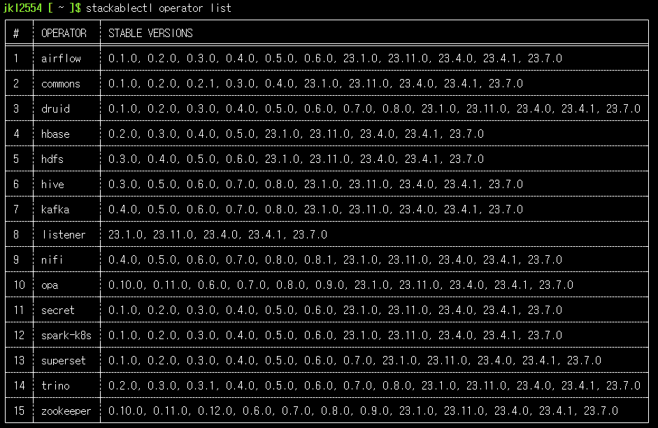
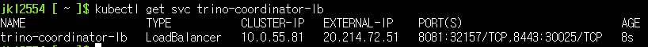
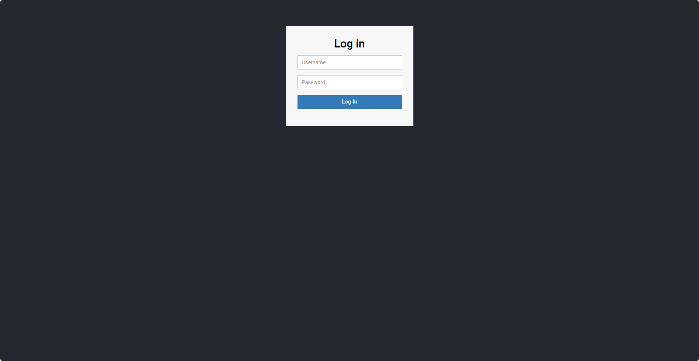

<!--more-->
# DOIK 6주차 stackable in aks
## AKS 배포
### cluster 배포
```sh

AZURE_AKS_RESOURCE_GROUP="myaks-RG" # name of resource group where aks cluster was created
AZURE_AKS_CLUSTER_NAME="myaks" # name of aks cluster previously created
LOCATION="koreacentral"


az group create -n ${AZURE_AKS_RESOURCE_GROUP} -l ${LOCATION}
az aks create -n ${AZURE_AKS_CLUSTER_NAME} -g ${AZURE_AKS_RESOURCE_GROUP} --network-plugin azure \
              --enable-oidc-issuer --enable-workload-identity --generate-ssh-keys -s Standard_B4s_v2 \
              --kubernetes-version 1.27.7 --node-count 3 -z 1 2 3

# kubeconfig 파일 생성 및 환경변수 설정
az aks get-credentials -n ${AZURE_AKS_CLUSTER_NAME} -g ${AZURE_AKS_RESOURCE_GROUP} -f ./kubeconfig --overwrite-existing
export KUBECONFIG=$HOME/kubeconfig
echo "export KUBECONFIG=$HOME/kubeconfig" >> .bashrc
```

### AGIC(Application Gateway Ingress Controller) 배포
```sh
# 변수 설정
APPGW_NAME="agic-appgw"
APPGW_SUBNET="${APPGW_NAME}-subnet"

# 배포된 AKS 에서 변수 불러오기
CLUSTER_RESOURCE_GROUP="$(az aks show -g ${AZURE_AKS_RESOURCE_GROUP} -n ${AZURE_AKS_CLUSTER_NAME} --query "nodeResourceGroup" -o tsv)" 
CLUSTER_VNET=$(az network vnet list -g ${CLUSTER_RESOURCE_GROUP} -o tsv --query "[0].name")


# Create AGIC Subnet
az network vnet subnet create -n ${APPGW_SUBNET} -g ${CLUSTER_RESOURCE_GROUP} \
                        --vnet-name ${CLUSTER_VNET} --address-prefixes "10.225.0.0/16"


## Application Gateway 생성
az network application-gateway create -n ${APPGW_NAME} -g ${CLUSTER_RESOURCE_GROUP} \
                         --sku Standard_v2 --public-ip-address "${APPGW_NAME}-pip" \
                         --vnet-name ${CLUSTER_VNET} --subnet ${APPGW_SUBNET} --priority 100

# Enable AGIC Add-on
APPGW_ID=$(az network application-gateway show -n ${APPGW_NAME} -g ${CLUSTER_RESOURCE_GROUP} -o tsv --query "id")
az aks enable-addons -n ${AZURE_AKS_CLUSTER_NAME} -g ${AZURE_AKS_RESOURCE_GROUP} -a ingress-appgw --appgw-id ${APPGW_ID}
```

### Azure DNS 생성 및 권한 부여

```sh
## Managed Identity 변수 설정
IDENTITY_NAME="ExternalDNS-${AZURE_AKS_CLUSTER_NAME}"

# 배포된 AKS 에서 변수 불러오기
CLUSTER_RESOURCE_GROUP="$(az aks show -g ${AZURE_AKS_RESOURCE_GROUP} -n ${AZURE_AKS_CLUSTER_NAME} --query "nodeResourceGroup" -o tsv)" 
# managed identity 배포
az identity create --resource-group "${CLUSTER_RESOURCE_GROUP}" --name "${IDENTITY_NAME}"

# Azure DNS Zone 생성
AZURE_DNS_ZONE_RESOURCE_GROUP="Common-rg" # Azure DNS Zone 리소스 그룹 이름
AZURE_DNS_ZONE="hyugo.biz" # Azure DNS Zone 이름 여기선 hyugo.biz 사용

az group create -n ${AZURE_DNS_ZONE_RESOURCE_GROUP} -l ${LOCATION}
az network dns zone create -n ${AZURE_DNS_ZONE} -g ${AZURE_DNS_ZONE_RESOURCE_GROUP}

# Client ID 구성
IDENTITY_CLIENT_ID=$(az identity show --resource-group "${CLUSTER_RESOURCE_GROUP}" \
  --name "${IDENTITY_NAME}" --query "clientId" --output tsv)


# Azure DNS Zone에 권한 부여
DNS_ID=$(az network dns zone show --name "${AZURE_DNS_ZONE}" \
  --resource-group "${AZURE_DNS_ZONE_RESOURCE_GROUP}" --query "id" --output tsv)

az role assignment create --role "DNS Zone Contributor" \
  --assignee "${IDENTITY_CLIENT_ID}" --scope "${DNS_ID}"

# 페더레이션 자격증명 부여
OIDC_ISSUER_URL="$(az aks show -n ${AZURE_AKS_CLUSTER_NAME} -g ${AZURE_AKS_RESOURCE_GROUP} --query "oidcIssuerProfile.issuerUrl" -otsv)"

az identity federated-credential create -n ${IDENTITY_NAME} -g ${CLUSTER_RESOURCE_GROUP} \
                            --identity-name ${IDENTITY_NAME} --issuer "${OIDC_ISSUER_URL}" \
                            --subject "system:serviceaccount:default:external-dns"


# DNS 네임 서버 목록 확인, 아래 서버를 DNS Hosting업체의 네임서버에 설정해주면 public DNS Query가 가능
az network dns zone show -n ${AZURE_DNS_ZONE} -g ${AZURE_DNS_ZONE_RESOURCE_GROUP} --query nameServers -o tsv
```

### Exteral DNS 배포
```sh
# Secret 배포
cat <<EOF > azure.json
{
  "subscriptionId": "$(echo ${DNS_ID} | cut -c 16-51)",
  "resourceGroup": "${AZURE_DNS_ZONE_RESOURCE_GROUP}",
  "useWorkloadIdentityExtension": true
}
EOF
kubectl create secret generic azure-config-file --namespace "default" --from-file azure.json
# External DNS 배포
cat << EOF > ExternalDNS-RBAC.yaml
apiVersion: v1
kind: ServiceAccount
metadata:
  name: external-dns
  annotations:
    azure.workload.identity/client-id: "${IDENTITY_CLIENT_ID}"
---
apiVersion: rbac.authorization.k8s.io/v1
kind: ClusterRole
metadata:
  name: external-dns
rules:
  - apiGroups: [""]
    resources: ["services","endpoints","pods", "nodes"]
    verbs: ["get","watch","list"]
  - apiGroups: ["extensions","networking.k8s.io"]
    resources: ["ingresses"]
    verbs: ["get","watch","list"]
---
apiVersion: rbac.authorization.k8s.io/v1
kind: ClusterRoleBinding
metadata:
  name: external-dns-viewer
roleRef:
  apiGroup: rbac.authorization.k8s.io
  kind: ClusterRole
  name: external-dns
subjects:
  - kind: ServiceAccount
    name: external-dns
    namespace: default
---
apiVersion: apps/v1
kind: Deployment
metadata:
  name: external-dns
spec:
  strategy:
    type: Recreate
  selector:
    matchLabels:
      app: external-dns
  template:
    metadata:
      labels:
        app: external-dns
        azure.workload.identity/use: "true"
    spec:
      serviceAccountName: external-dns
      containers:
        - name: external-dns
          image: registry.k8s.io/external-dns/external-dns:v0.14.0
          args:
            - --source=service
            - --source=ingress
            - --domain-filter=${AZURE_DNS_ZONE} # (optional) limit to only ${AZURE_DNS_ZONE} domains; change to match the zone created above.
            - --provider=azure
            - --azure-resource-group=${AZURE_DNS_ZONE_RESOURCE_GROUP} # (optional) use the DNS zones from the tutorial's resource group
            - --txt-prefix=externaldns-
          volumeMounts:
            - name: azure-config-file
              mountPath: /etc/kubernetes
              readOnly: true
      volumes:
        - name: azure-config-file
          secret:
            secretName: azure-config-file
EOF
## deploy ExternalDNS With RBAC cluster
kubectl apply -f ExternalDNS-RBAC.yaml

```
  
[배포 완료된 클러스터]  
## Stackablectl
### 설치
```sh
# 다운로드
#curl -L -o stackablectl https://github.com/stackabletech/stackable-cockpit/releases/download/stackablectl-1.0.0-rc2/stackablectl-x86_64-unknown-linux-gnu
curl -L -o stackablectl https://github.com/stackabletech/stackable-cockpit/releases/download/stackablectl-1.0.0-rc3/stackablectl-x86_64-unknown-linux-gnu
chmod +x stackablectl
mv $HOME/.local/bin
```
### 설치 확인
```sh
# 제공 오퍼레이터
stackablectl operator list

# 제공 스택
stackablectl stack list

# 제공 데모 : Stackable release 설치 > 스택 구성 > 데이터 구성
stackablectl demo list
```
  
[제공 오퍼레이터]  

  
[제공 스택]  

  
[제공 데모]  


## Demo1: trino-Taxi-Data
### Demo 정보 확인
```sh
stackablectl demo describe trino-taxi-data
```


### Demo 설치
```sh
# [터미널] 모니터링
watch -d "kubectl get pod -n stackable-operators;echo;kubectl get pod,job,svc,pvc"

# 데모 설치 : 데이터셋 다운로드 job 포함 8분 정도 소요
stackablectl demo install trino-taxi-data
```
  
[배포 히스토리]  


  
[모니터링]  


### 설치 확인
```sh
# 설치 확인
helm list -n stackable-operators
helm list

kubectl top node
kubectl top pod -A

kubectl get-all -n default
kubectl get deploy,sts,pod
kubectl get job
kubectl get job load-ny-taxi-data -o yaml | kubectl neat | cat -l yaml
kubectl get job create-ny-taxi-data-table-in-minio -o yaml | kubectl neat | cat -l yaml
kubectl get job setup-superset -o yaml | kubectl neat | cat -l yaml
kubectl get job superset -o yaml | kubectl neat | cat -l yaml

kubectl get sc,pvc,pv
kubectl get pv |grep gp3
kubectl get sc secrets.stackable.tech -o yaml | kubectl neat | cat -l yaml
kubectl df-pv
kubectl get svc,ep,endpointslices
kubectl get cm,secret

kubectl get cm minio -o yaml | kubectl neat | cat -l yaml
kubectl describe cm minio

kubectl get cm hive-metastore-default -o yaml | kubectl neat | cat -l yaml
kubectl get cm hive -o yaml | kubectl neat | cat -l yaml
kubectl get cm postgresql-hive-extended-configuration -o yaml | kubectl neat | cat -l yaml

kubectl get cm minio-coordinator-default -o yaml | kubectl neat | cat -l yaml
kubectl get cm minio-coordinator-default-catalog -o yaml | kubectl neat | cat -l yaml
kubectl get cm minio-worker-default -o yaml | kubectl neat | cat -l yaml
kubectl get cm minio-worker-default-catalog -o yaml | kubectl neat | cat -l yaml
kubectl get cm create-ny-taxi-data-table-in-minio-script -o yaml | kubectl neat | cat -l yaml

kubectl get cm superset-node-default -o yaml | kubectl neat | cat -l yaml
kubectl get cm superset-init-db -o yaml | kubectl neat | cat -l yaml
kubectl get cm setup-superset-script -o yaml | kubectl neat | cat -l yaml

kubectl get secret minio -o yaml | kubectl neat | cat -l yaml
kubectl get secret minio-s3-credentials -o yaml | kubectl neat | cat -l yaml
kubectl get secret postgresql-hive -o yaml | kubectl neat | cat -l yaml
kubectl get secret postgresql-superset -o yaml | kubectl neat | cat -l yaml
kubectl get secret minio-users -o yaml | kubectl neat | cat -l yaml
kubectl get secret minio-internal-secret -o yaml | kubectl neat | cat -l yaml
kubectl get secret superset-credentials -o yaml | kubectl neat | cat -l yaml
kubectl get secret superset-mapbox-api-key -o yaml | kubectl neat | cat -l yaml

kubectl get crd | grep stackable
kubectl explain minioclusters
kubectl describe minioclusters.minio.stackable.tech

kubectl get hivecluster,opacluster,s3connection
kubectl get supersetcluster,supersetdb
kubectl get miniocluster,miniocatalog

kubectl get hivecluster -o yaml | kubectl neat | cat -l yaml
kubectl get s3connection -o yaml | kubectl neat | cat -l yaml
kubectl get supersetcluster -o yaml | kubectl neat | cat -l yaml
kubectl get supersetdb -o yaml | kubectl neat | cat -l yaml
kubectl get miniocluster -o yaml | kubectl neat | cat -l yaml
kubectl get miniocatalog -o yaml | kubectl neat | cat -l yaml

# 배포 스택 정보 확인 : 바로 확인 하지 말고, 설치 완료 후 아래 확인 할 것 - Endpoint(접속 주소 정보), Conditions(상태 정보)
stackablectl stacklet list
# 배포 스택의 product 접속 계정 정보 확인 : 대부분 admin / adminadmin 계정 정보 사용
stackablectl stacklet credentials superset superset
stackablectl stacklet credentials minio minio-console  # admin / adminadmin 계정 정보 출력 안됨... 아직은 rc 단계라 그런듯

# 배포 오퍼레이터 확인
stackablectl operator installed
# 배포 스택 정보 확인
stackablectl stacklet list
```
  
[배포 스택 정보 확인]  
- 사설 접속만 가능한 상태이므로, 필요한 리소스 배포 수행
### 각 배포 스택 접속 주소 생성
#### minio-ingress 배포
```sh
# DNS Zone 변수 설정
AZURE_DNS_ZONE=hyugo.biz

# minio-ingress 배포
cat <<EOT > minio-ingress.yaml
apiVersion: networking.k8s.io/v1
kind: Ingress
metadata:
  labels: 
    app: minio
  name: minio-ingress
spec: 
  ingressClassName: azure-application-gateway
  rules: 
  - host: minio.$AZURE_DNS_ZONE
    http: 
      paths: 
      - backend: 
          service: 
            name: minio-console
            port: 
              number: 9001
        path: /*
        pathType: ImplementationSpecific
EOT
kubectl apply -f minio-ingress.yaml
```
#### ingress 배포 확인
```sh
kubectl get ingress minio-ingress
# 접속 주소
echo http://minio.$AZURE_DNS_ZONE
# 접속 계정
# admin / adminadmin
```
#### superset-ingress 배포
```sh
# DNS Zone 변수 설정
AZURE_DNS_ZONE=hyugo.biz

# superset-ingress 배포
cat <<EOT > superset-ingress.yaml
apiVersion: networking.k8s.io/v1
kind: Ingress
metadata:
  labels: 
    app: superset
  name: superset-ingress
spec: 
  ingressClassName: azure-application-gateway
  rules: 
  - host: superset.$AZURE_DNS_ZONE
    http: 
      paths: 
      - backend: 
          service: 
            name: superset-external
            port: 
              number: 8088
        path: /*
        pathType: ImplementationSpecific
EOT
kubectl apply -f superset-ingress.yaml
```
### ingress 배포 확인
```sh
kubectl get ingress superset-ingress
# 접속 주소 
echo http://superset.$AZURE_DNS_ZONE
# 접속 계정
# admin / adminadmin
```
  
[배포 확인]  
  
    
[접속 확인]  


### trino-loadbalancer 배포
```sh
cat <<EOT > trino-elb.yaml
apiVersion: v1
kind: Service
metadata:
  labels:
    app.kubernetes.io/component: coordinator
    app.kubernetes.io/instance: trino
  name: trino-coordinator-lb
  namespace: default
spec:
  internalTrafficPolicy: Cluster
  ports:
  - name: metrics
    port: 8081
  - name: https
    port: 8443
  selector:
    app.kubernetes.io/component: coordinator
    app.kubernetes.io/instance: trino
    app.kubernetes.io/name: trino
  type: LoadBalancer
EOT
kubectl apply -f trino-elb.yaml
```
### LB 배포 확인
```sh
kubectl get svc trino-coordinator-lb
# 접속 주소 
echo https://$(kubectl get svc trino-coordinator-lb -o=jsonpath={.status.loadBalancer.ingress[0].ip}):8443
# 접속 계정
# admin / adminadmin
```

  
[배포 확인]  
   
  
[접속 확인]  
