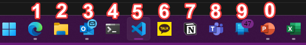
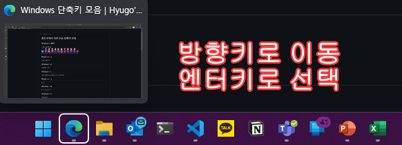

<!--more-->
# Windows 단축키 모음
## `Windows` + `숫자`
### 작업표시줄 앱 실행

## Windows + t
### 작업표시줄 커서

## Windows + e
파일 탐색기 열기

## Windows + s
시작-검색(q로도 가능하나 원래 코타나 호출 명령어)

## Windows + a
Wifi, Bluetooth, 소리, 등

## Windows + b
숨겨진 아이콘 표시

## Windows + n
캘린더 알림

## Windows + <Shift> + 방향키
화면 분할, 멀티모니터 화면이동
![Windows+[Shift]+방향키.png](Windows+[Shift]+방향키.png)
## Windows + z
화면분할

## Windows + Shift + s
화면 캡처

## Windows + p
화면 표시방식 변경

## Windows + d
바탕화면으로(두번 눌러 복귀 가능)

## Windows + ,
바탕화면 잠시보기

## Windows + v
클립보드 리스트

## Windows + =
돋보기

## 방해금지
발표할때 알림 안 옴

## Ctrl + <Shift> + w
탭 끄기
![Ctrl+[Shift]+w.png](Ctrl+[Shift]+w.png)
## Ctrl + <Shift> +Tab
탭 이동
![Ctrl+[Shift]+Tab.png](Ctrl+[Shift]+Tab.png)
## Ctrl + z
되돌리기

## Ctrl + Shift + z
되돌리기 취소

## Alt + Tab
창 이동

## Ctrl + Alt + Tab
창 이동 고정

## Windows + Tab
작업 목록

## Ctrl + 방향키
다음 단어 까지 이동

## Home
줄 처음으로 이동

## End
줄 끝으로 이동

## Ctrl + Home
문서 처음으로 이동

## Ctrl + End
문서 끝으로 이동
